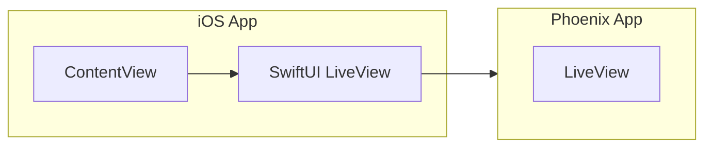

<!-- livebook:{"file_entries":[{"name":"add-liveview-swiftui-client-package-0.2.0.png","type":"attachment"},{"name":"default-xcode-app.png","type":"attachment"},{"name":"select-package-products.png","type":"attachment"},{"name":"trust-and-enable-case-path-macros.png","type":"attachment"},{"name":"trust-and-enable-liveview-native-macros.png","type":"attachment"},{"name":"trust-and-enable-liveview-native-stylesheet.png","type":"attachment"}]} -->

# Create a SwiftUI Application

```elixir
notebook_path = __ENV__.file |> String.split("#") |> hd()

Mix.install(
  [
    {:kino_live_view_native, github: "liveview-native/kino_live_view_native"}
  ],
  config: [
    server: [
      {ServerWeb.Endpoint,
       [
         server: true,
         url: [host: "localhost"],
         adapter: Phoenix.Endpoint.Cowboy2Adapter,
         render_errors: [
           formats: [html: ServerWeb.ErrorHTML, json: ServerWeb.ErrorJSON],
           layout: false
         ],
         pubsub_server: Server.PubSub,
         live_view: [signing_salt: "JSgdVVL6"],
         http: [ip: {127, 0, 0, 1}, port: 4000],
         secret_key_base: String.duplicate("a", 64),
         live_reload: [
           patterns: [
             ~r"priv/static/(?!uploads/).*(js|css|png|jpeg|jpg|gif|svg|styles)$",
             ~r/#{notebook_path}$/
           ]
         ]
       ]}
    ],
    kino: [
      group_leader: Process.group_leader()
    ],
    phoenix: [
      template_engines: [neex: LiveViewNative.Engine]
    ],
    phoenix_template: [format_encoders: [swiftui: Phoenix.HTML.Engine]],
    mime: [
      types: %{"text/swiftui" => ["swiftui"], "text/styles" => ["styles"]}
    ],
    live_view_native: [plugins: [LiveViewNative.SwiftUI]],
    live_view_native_stylesheet: [
      content: [
        swiftui: [
          "lib/**/*swiftui*",
          notebook_path
        ]
      ],
      output: "priv/static/assets"
    ]
  ],
  force: true
)
```

## Overview

This guide will teach you how to set up a SwiftUI Application for LiveView Native.

Typically, we recommend using the `mix lvn.install` task as described in the [Installation Guide](https://hexdocs.pm/live_view_native/installation.html#5-enable-liveview-native) to add LiveView Native to a Phoenix project. However, we will walk through the steps of manually setting up an Xcode iOS project to learn how the iOS side of a LiveView Native application works.

In future lessons, you'll use this iOS application to view iOS examples in the Xcode simulator (or a physical device if you prefer.)

## Prerequisites

First, make sure you have followed the [Getting Started](https://hexdocs.pm/live_view_native/getting_started.md) guide. Then evaluate the smart cell below and visit http://localhost:4000 to ensure the Phoenix server runs properly. You should see the text `Hello from LiveView!`

<!-- livebook:{"attrs":"e30","chunks":[[0,85],[87,499],[588,49],[639,51]],"kind":"Elixir.Server.SmartCells.LiveViewNative","livebook_object":"smart_cell"} -->

```elixir
require Server.Livebook
import Server.Livebook
import Kernel, except: [defmodule: 2]

defmodule ServerWeb.ExampleLive.SwiftUI do
  use LiveViewNative.Component,
    format: :swiftui

  def render(assigns, _interface) do
    ~LVN"""
    <Text>Hello, from LiveView Native!</Text>
    """
  end
end

defmodule ServerWeb.ExampleLive do
  use ServerWeb, :live_view

  use LiveViewNative.LiveView,
    formats: [:swiftui],
    layouts: [
      swiftui: {ServerWeb.Layouts.SwiftUI, :app}
    ]

  @impl true
  def render(assigns) do
    ~H"""
    <p>Hello from LiveView!</p>
    """
  end
end
|> Server.SmartCells.LiveViewNative.register("/")

import Server.Livebook, only: []
import Kernel
:ok
```

## Create the iOS Application

Open Xcode and select Create New Project.

<!-- livebook:{"break_markdown":true} -->


<!-- livebook:{"break_markdown":true} -->

Select the `iOS` and `App` options to create an iOS application. Then click `Next`.

<!-- livebook:{"break_markdown":true} -->


<!-- livebook:{"break_markdown":true} -->

Choose options for your new project that match the following image, then click `Next`.

### What do these options mean?

* **Product Name:** The name of the application. This can be any valid name. We've chosen `Guides`.
* **Organization Identifier:** A reverse DNS string that uniquely identifies your organization. If you don't have a company identifier, [Apple recomends](https://developer.apple.com/documentation/xcode/creating-an-xcode-project-for-an-app) using `com.example.your_name` where `your_name` is your organization or personal name.
* **Interface:**: The Xcode user interface to use. Select **SwiftUI** to create an app that uses the SwiftUI app lifecycle.
* **Language:** Determines which language Xcode should use for the project. Select `Swift`.


<!-- livebook:{"break_markdown":true} -->


<!-- livebook:{"break_markdown":true} -->

Select an appropriate folder location where you would like to store the iOS project, then click `Create`.

<!-- livebook:{"break_markdown":true} -->


<!-- livebook:{"break_markdown":true} -->

You should see the default iOS application generated by Xcode.

<!-- livebook:{"break_markdown":true} -->


## Add the LiveView Client SwiftUI Package

In Xcode from the project you just created, select `File -> Add Package Dependencies`. Then, search for `liveview-client-swiftui`. Once you have selected the package, click `Add Package`.

The image below was created using version `0.2.0`. You should select whichever is the latest version of LiveView Native.

<!-- livebook:{"break_markdown":true} -->


<!-- livebook:{"break_markdown":true} -->

Choose the Package Products for `liveview-client-swiftui`. Select `Guides` as the target for `LiveViewNative` and `LiveViewNativeStylesheet`. This adds both of these dependencies to your iOS project.

<!-- livebook:{"break_markdown":true} -->


<!-- livebook:{"break_markdown":true} -->

At this point, you'll need to enable permissions for plugins used by LiveView Native.
You should see the following prompt. Click `Trust & Enable All`.

<!-- livebook:{"break_markdown":true} -->


<!-- livebook:{"break_markdown":true} -->

You'll also need to manually navigate to the error tab (shown below) and manually trust and enable packages. Click on each error to trigger a prompt. Select `Trust & Enable All` to enable the plugin.

The specific plugins are subject to change. At the time of writing you need to enable `LiveViewNativeStylesheetMacros`, `LiveViewNativeMacros`, and `CasePathMacros` as shown in the images below.

<!-- livebook:{"break_markdown":true} -->


<!-- livebook:{"break_markdown":true} -->


<!-- livebook:{"break_markdown":true} -->


## Setup the SwiftUI LiveView

The [ContentView](https://developer.apple.com/tutorials/swiftui-concepts/exploring-the-structure-of-a-swiftui-app#Content-view) contains the main view of our iOS application.

Replace the code in the `ContentView` file with the following to connect the SwiftUI application and the Phoenix application.

<!-- livebook:{"break_markdown":true} -->

```swift
import SwiftUI
import LiveViewNative

struct ContentView: View {

    var body: some View {
        LiveView(.automatic(
            development: .localhost(path: "/"),
            production: .custom(URL(string: "https://example.com/")!)
        ))
    }
}


// Optionally preview the native UI in Xcode
#Preview {
    ContentView()
}
```

<!-- livebook:{"break_markdown":true} -->

The code above sets up the SwiftUI LiveView. By default, the SwiftUI LiveView connects to any Phoenix app running on http://localhost:4000.

<!-- livebook:{"break_markdown":true} -->

<!-- Learn more at https://mermaid-js.github.io/mermaid -->



## Start the Active Scheme

Click the `start active scheme` button <i class="ri-play-fill"></i> to build the project and run it on the iOS simulator.

> A [build scheme](https://developer.apple.com/documentation/xcode/build-system) contains a list of targets to build, and any configuration and environment details that affect the selected action. For example, when you build and run an app, the scheme tells Xcode what launch arguments to pass to the app.
> 
> * https://developer.apple.com/documentation/xcode/build-system

After you start the active scheme, the simulator should open the iOS application and display `Hello from LiveView Native!`. If you encounter any issues see the **Troubleshooting** section below.

<!-- livebook:{"break_markdown":true} -->

<div style="height: 800; width: 100%; display: flex; height: 800px; justify-content: center; align-items: center;">

</div>

## Troubleshooting

If you encountered any issues with the native application, here are some troubleshooting steps you can use:

* **Reset Package Caches:** In the Xcode application go to `File -> Packages -> Reset Package Caches`.
* **Update Packages:** In the Xcode application go to `File -> Packages -> Update to Latest Package Versions`.
* **Rebuild the Active Scheme**: In the Xcode application, press the `start active scheme` button <i class="ri-play-fill"></i> to rebuild the active scheme and run it on the Xcode simulator.
* Update your [Xcode](https://developer.apple.com/xcode/) version if it is not already the latest version
* Check for error messages in the Livebook smart cells.

You can also [raise an issue](https://github.com/liveview-native/live_view_native/issues/new) if you would like support from the LiveView Native team.
