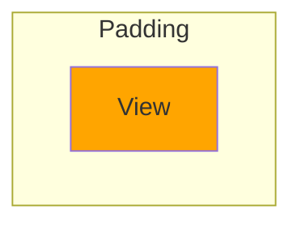
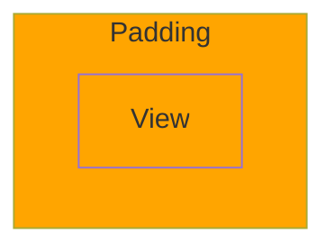

# Stylesheets

[](https://livebook.dev/run?url=https%3A%2F%2Fraw.githubusercontent.com%2Fliveview-native%2Flive_view_native%2Fmain%2Fguides%livebooks%stylesheets.livemd)

## Overview

In this guide, you'll learn how to use stylesheets to customize the appearance of your LiveView Native Views. You'll also learn about the inner workings of how LiveView Native uses stylesheets to implement modifiers, and how those modifiers style and customize SwiftUI Views. By the end of this lesson, you'll have the fundamentals you need to create beautiful native UIs.

## The Stylesheet DSL

SwiftUI employs **modifiers** to style and customize views. In SwiftUI syntax, each modifier is a function that can be chained onto the view they modify. Here's a basic example of making text red using the [foregroundStyle](https://developer.apple.com/documentation/swiftui/text/foregroundstyle(_:)) modifier:

```swift
Text("Some Red Text")
  .foregroundStyle(.red)
```

Many modifiers can be applied to a view. Here's an example using [foregroundStyle](https://developer.apple.com/documentation/swiftui/text/foregroundstyle(_:)) and [frame](https://developer.apple.com/documentation/swiftui/view/frame(width:height:alignment:)).

```swift
Text("Some Red Text")
  .foregroundStyle(.red)
  .frame(height: 100, width: 100)
```

In LiveView Native, we use `~SHEET` sigil stylesheets to organize modifers by classes using an Elixir-oriented DSL similar to CSS for styling web elements.

Here's the same `foregroundStyle` and `frame` modifiers grouped into a "color-red" class in a stylesheet:

<!-- livebook:{"force_markdown":true} -->

```elixir
~SHEET"""
  "color-red" do
    foregroundColor(.red)
    frame(height: 100, width: 100)
  end
"""
```

The DSL (Domain Specific Language) used in LiveView Native drops the `.` dot before each modifier, but otherwise remains largely the same. We do not document every modifier separately, since you can translate SwiftUI examples into the DSL syntax.

There are instances where modifier argument values are not compatible with Elixir terms, but these are infrequent and beyond the scope of this guide. In most cases, you can write your LiveView Native templates in such a way that this is a non-issue.

For more, you can find documentation and examples of modifiers on [Apple's SwiftUI documentation](https://developer.apple.com/documentation/swiftui) which is comprehensive and thorough, though it may feel unfamiliar at first for Elixir Developers when compared to [HexDocs](https://hexdocs.pm/).

If you use Visual Studio Code, we strongly recommend you install the [LiveView Native Visual Studio Code Extension](https://github.com/liveview-native/liveview-native-vscode) which provides autocompletion and type information thus making modifiers significantly easier to write and lookup.

## Writing Stylesheets

LiveView Native employs stylesheet modules to style and modify the behavior of Views. These stylesheet modules define one or more classes, which each contain one or more modifiers.

Using a stylesheet within a LiveView module gives you access to any of the classes it defines. These classes can then be applied to SwiftUI Views.

<!-- livebook:{"break_markdown":true} -->

### Stylesheet Modules

Stylesheet modules define classes within the `~SHEET` sigil and must include `use LiveViewNative.Stylesheet, :swiftui`.

In this example, the stylesheet generates a `color-red` class. This class applies the [foregroundStyle](https://developer.apple.com/documentation/swiftui/view/foregroundstyle(_:)) SwiftUI modifier, which accepts an argument for color. In our example, we chose the [.red](https://developer.apple.com/documentation/swiftui/color/red) color.

```elixir
defmodule MyStyleSheet do
  use LiveViewNative.Stylesheet, :swiftui

  ~SHEET"""
  "color-red" do
    foregroundStyle(.red)
  end
  """
end
```

### Applying Stylesheet Classes to Views

To access the classes in the stylesheet, you can `use` the stylesheet module within a LiveView module.

The example below applies the `color-red` class we previously defined to display red text.

<!-- livebook:{"attrs":"eyJhY3Rpb24iOiI6aW5kZXgiLCJjb2RlIjoiZGVmbW9kdWxlIFNlcnZlci5SZWRUZXh0TGl2ZSBkb1xuICB1c2UgUGhvZW5peC5MaXZlVmlld1xuICB1c2UgTGl2ZVZpZXdOYXRpdmUuTGl2ZVZpZXdcbiAgdXNlIE15U3R5bGVTaGVldFxuXG4gIEBpbXBsIHRydWVcbiAgZGVmIHJlbmRlcigle2Zvcm1hdDogOnN3aWZ0dWl9ID0gYXNzaWducykgZG9cbiAgICB+U1dJRlRVSVwiXCJcIlxuICAgIDxUZXh0IGNsYXNzPVwiY29sb3ItcmVkXCI+XG4gICAgICBUaGlzIHRleHQgaXMgcmVkIVxuICAgIDwvVGV4dD5cbiAgICBcIlwiXCJcbiAgZW5kXG5lbmQiLCJwYXRoIjoiLyJ9","chunks":[[0,109],[111,263],[376,45],[423,63]],"kind":"Elixir.KinoLiveViewNative","livebook_object":"smart_cell"} -->

```elixir
defmodule Server.RedTextLive do
  use Phoenix.LiveView
  use LiveViewNative.LiveView
  use MyStyleSheet

  @impl true
  def render(%{format: :swiftui} = assigns) do
    ~SWIFTUI"""
    <Text class="color-red">
      This text is red!
    </Text>
    """
  end
end
```

### One Stylesheet Per LiveView

Currently, only one stylesheet can be applied within a LiveView. This is likely to change in the future to make stylesheets more composable.

## Classes

Classes within a stylsheet group modifiers together. These classes can be applied to a View using the `class` attribute so long as the LiveView uses the stylesheet that class is defined in.

<!-- livebook:{"break_markdown":true} -->

### Reusable Classes

We can reuse classes by injecting variables within the class name. When injecting a variable, it's necessary to instruct the rules parser on how to parse the value.

LiveView Native provides the following functions for that purpose:

* `to_boolean`
* `to_integer`
* `to_float`
* `to_ime`

Most of these functions should be self-explanatory other than the `to_ime` function. The `to_ime` function treats the injected value as a dot-accessed value. For example `red` would be treated as `.red` in the stylesheet.

Here's an example showing a a pattern for how we can create a `color-*` class to dynamically inject named colors.

```elixir
defmodule ReusableColorStyleSheet do
  use LiveViewNative.Stylesheet, :swiftui

  ~SHEET"""
  "color-" <> color_name do
    foregroundStyle(to_ime(color_name))
  end
  """
end
```

Here's how we can use that dynamic class in a LiveView to display some red text. Try changing `color-red` to `color-blue` or any other of SwiftUI's [fixed standard colors](https://developer.apple.com/documentation/uikit/uicolor/standard_colors#3174519).

<!-- livebook:{"attrs":"eyJhY3Rpb24iOiI6aW5kZXgiLCJjb2RlIjoiZGVmbW9kdWxlIFNlcnZlci5EeW5hbWljQ29sb3JzTGl2ZSBkb1xuICB1c2UgUGhvZW5peC5MaXZlVmlld1xuICB1c2UgTGl2ZVZpZXdOYXRpdmUuTGl2ZVZpZXdcbiAgdXNlIFJldXNhYmxlQ29sb3JTdHlsZVNoZWV0XG5cbiAgQGltcGwgdHJ1ZVxuICBkZWYgcmVuZGVyKCV7Zm9ybWF0OiA6c3dpZnR1aX0gPSBhc3NpZ25zKSBkb1xuICAgIH5TV0lGVFVJXCJcIlwiXG4gICAgPFRleHQgY2xhc3M9XCJjb2xvci1yZWRcIj5DaGFuZ2UgdGhlIGNvbG9yIG9mIHRoaXMgdGV4dCE8L1RleHQ+XG4gICAgXCJcIlwiXG4gIGVuZFxuZW5kIiwicGF0aCI6Ii8ifQ","chunks":[[0,109],[111,281],[394,45],[441,63]],"kind":"Elixir.KinoLiveViewNative","livebook_object":"smart_cell"} -->

```elixir
defmodule Server.DynamicColorsLive do
  use Phoenix.LiveView
  use LiveViewNative.LiveView
  use ReusableColorStyleSheet

  @impl true
  def render(%{format: :swiftui} = assigns) do
    ~SWIFTUI"""
    <Text class="color-red">Change the color of this text!</Text>
    """
  end
end
```

### Unbroken Class Names

While we support reusable classes, similar to [Tailwind](https://tailwindcss.com/docs/content-configuration#dynamic-class-names), classes must be complete, unbroken strings in your source files.

For example, you **cannot** concatenate two strings together to form a class name in the LiveView as seen in the **broken** example below.

<!-- livebook:{"force_markdown":true} -->

```elixir
<Text class={"color-#{Enum.random(["red", "blue"])}"}>randomly colored text</Text>
```

If you want dynamic classes, they must be unbroken. Here's how the code above could be written to follow this rule.

<!-- livebook:{"force_markdown":true} -->

```elixir
<Text class={Enum.random(["color-red", "color-blue"])}>randomly colored text</Text>
```

<!-- livebook:{"break_markdown":true} -->

### Your Turn: Dynamic Height and Width Classes

Create dynamic `h-*` and `w-*` classes. Make sure you wrap the dynamic value with `to_integer` so the rules parse knows to parse the value as an integer. Remember you can use the `frame` modifier to change the height and width of a view.

### Example Solution

```elixir
defmodule DynamicHeightAndWidthSheet do
  use LiveViewNative.Stylesheet, :swiftui

  ~SHEET"""
  "h-" <> height do
    frame(height: to_integer(height))
  end

  "w-" <> width do
    frame(width: to_integer(width))
  end
  """
end
```


Enter your solution below. We've provided some of the boilerplate for you, but none of the modifiers.

```elixir
defmodule DynamicHeightAndWidthSheet do
  use LiveViewNative.Stylesheet, :swiftui

  ~SHEET"""
  "h" <> height do
    
  end

  "w" <> width do
    
  end
  """
end
```

### Test Your Solution

You can use the LiveView below to test your stylesheet solution above.

The LiveView uses your stylesheet above to display four equally spaced Text views. If your solution works correctly, each view should be `100` pixels apart as seen in the image below.

<div style="height: 800; width: 100%; display: flex; height: 800px; justify-content: center; align-items: center;">

</div>

<!-- livebook:{"attrs":"eyJhY3Rpb24iOiI6aW5kZXgiLCJjb2RlIjoiIyBEbyBub3QgY2hhbmdlIHRoaXMgTGl2ZVZpZXdcbmRlZm1vZHVsZSBTZXJ2ZXIuRHluYW1pY0hlaWdodEFuZFdpZHRoTGl2ZSBkb1xuICB1c2UgUGhvZW5peC5MaXZlVmlld1xuICB1c2UgTGl2ZVZpZXdOYXRpdmUuTGl2ZVZpZXdcbiAgdXNlIER5bmFtaWNIZWlnaHRBbmRXaWR0aFNoZWV0XG5cbiAgQGltcGwgdHJ1ZVxuICBkZWYgcmVuZGVyKCV7Zm9ybWF0OiA6c3dpZnR1aX0gPSBhc3NpZ25zKSBkb1xuICAgIH5TV0lGVFVJXCJcIlwiXG4gICAgPEhTdGFjayBjbGFzcz1cImgtMTAwXCI+XG4gICAgICA8VGV4dCBjbGFzcz1cInctMTAwXCI+QTwvVGV4dD5cbiAgICAgIDxUZXh0IGNsYXNzPVwidy0xMDBcIj5CPC9UZXh0PlxuICAgIDwvSFN0YWNrPlxuICAgIDxIU3RhY2sgY2xhc3M9XCJoLTEwMFwiPlxuICAgICAgPFRleHQgY2xhc3M9XCJ3LTEwMFwiPkM8L1RleHQ+XG4gICAgICA8VGV4dCBjbGFzcz1cInctMTAwXCI+RDwvVGV4dD5cbiAgICA8L0hTdGFjaz5cbiAgICBcIlwiXCJcbiAgZW5kXG5lbmQiLCJwYXRoIjoiLyJ9","chunks":[[0,109],[111,478],[591,45],[638,63]],"kind":"Elixir.KinoLiveViewNative","livebook_object":"smart_cell"} -->

```elixir
# Do not change this LiveView
defmodule Server.DynamicHeightAndWidthLive do
  use Phoenix.LiveView
  use LiveViewNative.LiveView
  use DynamicHeightAndWidthSheet

  @impl true
  def render(%{format: :swiftui} = assigns) do
    ~SWIFTUI"""
    <HStack class="h-100">
      <Text class="w-100">A</Text>
      <Text class="w-100">B</Text>
    </HStack>
    <HStack class="h-100">
      <Text class="w-100">C</Text>
      <Text class="w-100">D</Text>
    </HStack>
    """
  end
end
```

### Multiple Classes

You can define multiple classes in the same stylesheet. The same modifier can apply to a view multiple times with different values. For instance, the 'frame' modifier can alter both the height and width of a view.

<!-- livebook:{"force_markdown":true} -->

```elixir
~SHEET"""
"tall" do
  frame(height: 200)
end

"wide" do
  frame(width: 200)
end
"""
```

The above classes would be applied to a view like so:

```html
<Text class="tall wide">Tall and Wide Text</Text>
```

## Modifiers

Modifiers modify a View's appearance or behavior. Be aware they are not limited to styling. LiveView Native supports nearly every modifier provided by SwiftUI.

<!-- livebook:{"break_markdown":true} -->

### Finding Modifiers

The [Configuring View Elements](https://developer.apple.com/documentation/swiftui/view#configuring-view-elements) section of apple documentation contains links to modifiers organized by category. In that documentation you'll find useful references such as [Style Modifiers](https://developer.apple.com/documentation/swiftui/view-style-modifiers), [Layout Modifiers](https://developer.apple.com/documentation/swiftui/view-layout), and [Input and Event Modifiers](https://developer.apple.com/documentation/swiftui/view-input-and-events).

You can also find the same modifiers with LiveView Native examples on the [LiveView Client SwiftUI Docs](https://liveview-native.github.io/liveview-client-swiftui/documentation/liveviewnative/paddingmodifier) however at the time of writing these examples are out of date.

<!-- livebook:{"break_markdown":true} -->

### Multiple Modifiers

Multiple modifiers can be applied within the same class like so.

<!-- livebook:{"force_markdown":true} -->

```elixir
~SHEET"""
"color-red" do
  foregroundStyle(.red)
  frame(height: 200, width: 200)
end
"""
```

<!-- livebook:{"break_markdown":true} -->

### Modifer Order

Unlike in CSS, modifier order matters. Changing the order that modifers are applied can have a significant impact on their behavior. The order of modifiers in the stylesheet matters, and the order of classes matters.

To demonstrate this concept, we're going to take a simple example of applying padding and background color.

If we apply the background color first, then the padding, The background is applied to original view, leaving the padding filled with whitespace.

<!-- livebook:{"force_markdown":true} -->

```elixir
background(.orange)
padding(20)
```



If we apply the padding first, then the background, the background is applied to the view with the padding, thus filling the entire area with background color.

<!-- livebook:{"force_markdown":true} -->

```elixir
padding(20)
background(.orange)
```



<!-- livebook:{"break_markdown":true} -->

Here's that same concept but made into a stylesheet. This stylesheet defines the modifiers in a different order within the `bg-then-padding` and the `padding-then-bg` classes. It also individually defines a `background` class and `padding` class.

In a moment, we'll use this stylesheet to demonstrate how changing the order of modifiers within a class, or changing the order of classes can affect our design.

```elixir
defmodule ModifierOrderSheet do
  use LiveViewNative.Stylesheet, :swiftui

  ~SHEET"""
  "bg-then-padding" do
    background(.red)
    padding(20)
  end

  "padding-then-bg" do
    padding(20)
    background(.red)
  end

  "padding" do
    padding(20)
  end

  "background" do
    background(.orange)
  end
  """
end
```

Now that we have a stylesheet defined, We'll use these styles within a LiveView. Run the example below in your similator and observe how in examples where padding was applied first, the entire area of the Text view is orange. In contrast, in examples where background was applied first, the padding is still filled with whitespace.

<!-- livebook:{"attrs":"eyJhY3Rpb24iOiI6aW5kZXgiLCJjb2RlIjoiZGVmbW9kdWxlIFNlcnZlci5Nb2RpZmllck9yZGVyTGl2ZSBkb1xuICB1c2UgUGhvZW5peC5MaXZlVmlld1xuICB1c2UgTGl2ZVZpZXdOYXRpdmUuTGl2ZVZpZXdcbiAgdXNlIE1vZGlmaWVyT3JkZXJTaGVldFxuXG4gIEBpbXBsIHRydWVcbiAgZGVmIHJlbmRlcigle2Zvcm1hdDogOnN3aWZ0dWl9ID0gYXNzaWducykgZG9cbiAgICB+U1dJRlRVSVwiXCJcIlxuICAgIDxUZXh0IGNsYXNzPVwiYmctdGhlbi1wYWRkaW5nXCI+QmFja2dyb3VuZCB0aGVuIHBhZGRpbmc8L1RleHQ+XG4gICAgPFRleHQgY2xhc3M9XCJwYWRkaW5nLXRoZW4tYmdcIj5QYWRkaW5nIHRoZW4gYmFja2dyb3VuZDwvVGV4dD5cblxuICAgIDxUZXh0IGNsYXNzPVwiYmFja2dyb3VuZCBwYWRkaW5nXCI+QmFja2dyb3VuZCB0aGVuIHBhZGRpbmcgKGNsYXNzZXMpPC9UZXh0PlxuICAgIDxUZXh0IGNsYXNzPVwicGFkZGluZyBiYWNrZ3JvdW5kXCI+UGFkZGluZyB0aGVuIGJhY2tncm91bmQgKGNsYXNzZXMpPC9UZXh0PlxuICAgIFwiXCJcIlxuICBlbmRcbmVuZCIsInBhdGgiOiIvIn0","chunks":[[0,109],[111,497],[610,45],[657,63]],"kind":"Elixir.KinoLiveViewNative","livebook_object":"smart_cell"} -->

```elixir
defmodule Server.ModifierOrderLive do
  use Phoenix.LiveView
  use LiveViewNative.LiveView
  use ModifierOrderSheet

  @impl true
  def render(%{format: :swiftui} = assigns) do
    ~SWIFTUI"""
    <Text class="bg-then-padding">Background then padding</Text>
    <Text class="padding-then-bg">Padding then background</Text>

    <Text class="background padding">Background then padding (classes)</Text>
    <Text class="padding background">Padding then background (classes)</Text>
    """
  end
end
```

## Static Properties

SwiftUI provides different values through dot notation. For example. the [.red](https://developer.apple.com/documentation/swiftui/color/red) notation we've already seen comes from a static property of the [Color](https://developer.apple.com/documentation/swiftui/color) struct.

Apple provides their own documentation on all of the static properties, and you'll typically find static properties referenced within the documentation of a modifier, struct, or enum.

For example, the [frame](https://developer.apple.com/documentation/swiftui/view/frame(width:height:alignment:)) modifier accepts an `alignment` parameter. Any dot-accessed value on the [Alignment](https://developer.apple.com/documentation/swiftui/alignment) struct can be provided as an argument.

The default value is [.center](https://developer.apple.com/documentation/swiftui/alignment/center). if we wanted the text to be left-aligned we could make it [.leading](https://developer.apple.com/documentation/swiftui/alignment/leading) instead.

<!-- livebook:{"force_markdown":true} -->

```elixir
~SHEET"""
"leading" do
  frame(alignment: .leading)
end
"""
```

## Custom Colors

You can set custom colors for SwiftUI views either via stylesheets or through the asset catalog. The SwiftUI [Color](https://developer.apple.com/documentation/swiftui/color) structure accepts either the name of a color in the asset catalog or the RGB values of the color.

Generally, using RGB values allows for quicker iteration, while using the asset catalog is more performant and customizable.

<!-- livebook:{"break_markdown":true} -->

### Custom Colors in Stylesheets

Here's an example of defining a custom color. We'll apply this `custom-color` class to a SwiftUI Text View in a moment.

```elixir
defmodule CustomColorStylesheet do
  use LiveViewNative.Stylesheet, :swiftui

  ~SHEET"""
  "custom-color" do
    # light blue
    foregroundStyle(Color(.sRGB, red: 0.4627, green: 0.8392, blue: 1.0))
  end
  """
end
```

Evaluate the example below and view the custom color in your simulator.

<!-- livebook:{"attrs":"eyJhY3Rpb24iOiI6aW5kZXgiLCJjb2RlIjoiZGVmbW9kdWxlIFNlcnZlci5DdXN0b21Db2xvclNoZWV0TGl2ZSBkb1xuICB1c2UgUGhvZW5peC5MaXZlVmlld1xuICB1c2UgTGl2ZVZpZXdOYXRpdmUuTGl2ZVZpZXdcbiAgdXNlIEN1c3RvbUNvbG9yU3R5bGVzaGVldFxuXG4gIEBpbXBsIHRydWVcbiAgZGVmIHJlbmRlcigle2Zvcm1hdDogOnN3aWZ0dWl9ID0gYXNzaWducykgZG9cbiAgICB+U1dJRlRVSVwiXCJcIlxuICAgIDxUZXh0IGNsYXNzPVwiY3VzdG9tLWNvbG9yXCI+SGVsbG8gZnJvbSBMaXZlVmlldyBOYXRpdmUhPC9UZXh0PlxuICAgIFwiXCJcIlxuICBlbmRcbmVuZCIsInBhdGgiOiIvIn0","chunks":[[0,109],[111,282],[395,45],[442,63]],"kind":"Elixir.KinoLiveViewNative","livebook_object":"smart_cell"} -->

```elixir
defmodule Server.CustomColorSheetLive do
  use Phoenix.LiveView
  use LiveViewNative.LiveView
  use CustomColorStylesheet

  @impl true
  def render(%{format: :swiftui} = assigns) do
    ~SWIFTUI"""
    <Text class="custom-color">Hello from LiveView Native!</Text>
    """
  end
end
```

### Your Turn: Custom Colors in the Asset Catalog

Custom colors can be defined in the asset catalog (https://developer.apple.com/documentation/xcode/managing-assets-with-asset-catalogs). You're going to define a new color in your iOS App.

To create a new color go to the `Assets` folder in your iOS app and create a new color set.

<!-- livebook:{"break_markdown":true} -->


<!-- livebook:{"break_markdown":true} -->

To create a color set, enter the RGB values or a hexcode.

<!-- livebook:{"break_markdown":true} -->


<!-- livebook:{"break_markdown":true} -->

The defined color is now available for use within Stylesheets. However, the app needs to be re-compiled to pick up a new color set. Make sure you re-build your SwiftUI Application before moving on.

Then evaluate the code below. You'll use the `my-color` class in a moment.

```elixir
defmodule CustomColorAssetSheet do
  use LiveViewNative.Stylesheet, :swiftui

  ~SHEET"""
  "my-color" do
    foregroundStyle(Color("MyColor"))
  end
  """
end
```

This next example uses the `my-color` class we just defined and styles some text using your custom color. Evaluate the cell and view it in you simulator. You should see some text with your new custom color applied to it.

<!-- livebook:{"attrs":"eyJhY3Rpb24iOiI6aW5kZXgiLCJjb2RlIjoiZGVmbW9kdWxlIFNlcnZlci5DdXN0b21Db2xvckFzc2V0TGl2ZSBkb1xuICB1c2UgUGhvZW5peC5MaXZlVmlld1xuICB1c2UgTGl2ZVZpZXdOYXRpdmUuTGl2ZVZpZXdcbiAgdXNlIEN1c3RvbUNvbG9yQXNzZXRTaGVldFxuXG4gIEBpbXBsIHRydWVcbiAgZGVmIHJlbmRlcigle2Zvcm1hdDogOnN3aWZ0dWl9ID0gYXNzaWducykgZG9cbiAgICB+U1dJRlRVSVwiXCJcIlxuICAgIDxUZXh0IGNsYXNzPVwibXktY29sb3JcIj5UaGlzIHRleHQgc2hvdWxkIG1hdGNoIHRoZSBjb2xvciBpbiB5b3VyIGFzc2V0IGNhdGFsb2d1ZTwvVGV4dD5cbiAgICBcIlwiXCJcbiAgZW5kXG5lbmQiLCJwYXRoIjoiLyJ9","chunks":[[0,109],[111,307],[420,45],[467,63]],"kind":"Elixir.KinoLiveViewNative","livebook_object":"smart_cell"} -->

```elixir
defmodule Server.CustomColorAssetLive do
  use Phoenix.LiveView
  use LiveViewNative.LiveView
  use CustomColorAssetSheet

  @impl true
  def render(%{format: :swiftui} = assigns) do
    ~SWIFTUI"""
    <Text class="my-color">This text should match the color in your asset catalogue</Text>
    """
  end
end
```
