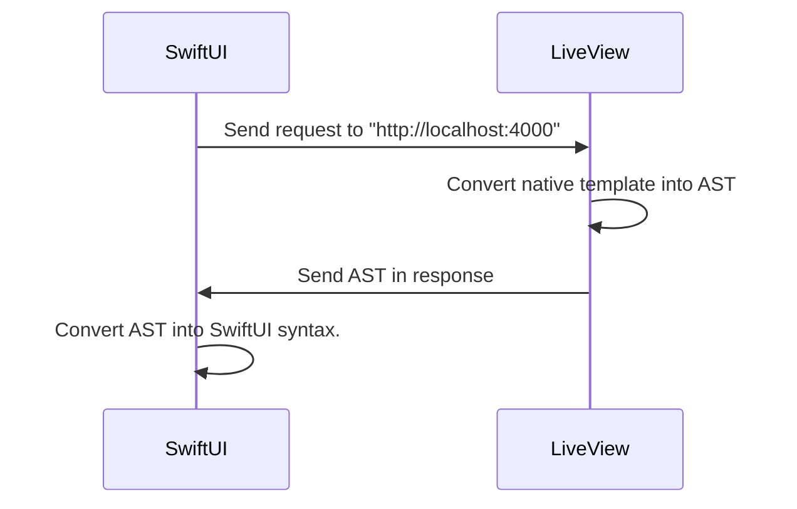
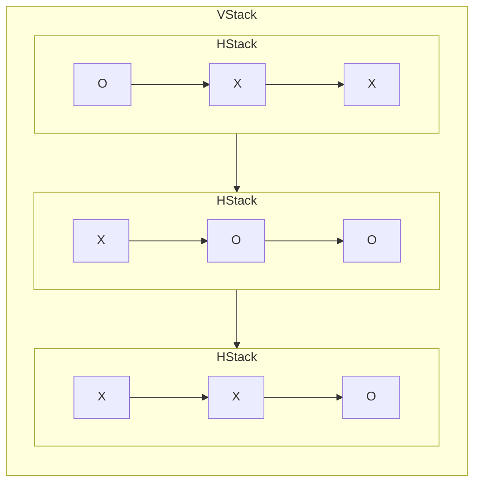
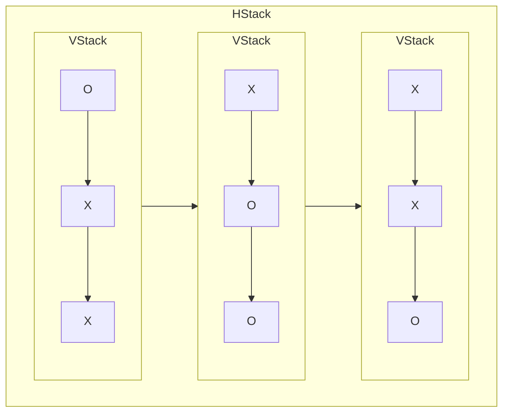

# SwiftUI Views

```elixir
Mix.install(
  [
    {:kino_live_view_native, github: "liveview-native/kino_live_view_native"}
    # {:kino_live_view_native, path: "../kino_live_view_native"}
  ],
  config: [
    live_view_native: [plugins: [LiveViewNativeSwiftUi]]
  ],
  force: true
)

KinoLiveViewNative.start([])
```

## Overview

LiveViewNative aims to use minimal SwiftUI code. All patterns for building interactive UIs are the same as LiveView. However, unlike LiveView for the web, LiveView Native uses SwiftUI templates to build the native UI.

This lesson will teach you how to build SwiftUI templates using common SwiftUI views.

## Platform Specific Render

LiveView Native utilizes a single LiveView for both the web and native views, but the templates are platform-specific. The native render function returns a `~SwiftUI` template, and the web render function returns a `~H` (HEEx) template.

Here's an example of both render functions in a LiveView Native LiveView.

<!-- livebook:{"force_markdown":true} -->

```elixir
@impl true
def render(%{platform_id: :swiftui} = assigns) do
  ~SWIFTUI"""
  <Text>Hello from LiveView Native!</Text>
  """
end

def render(assigns) do
  ~H"""
  <p>Hello from LiveView!</p>
  """
end
```

In future examples, we're going to focus on the SwiftUI render function in all of our examples and ignore the web function.

## SwiftUI Views

In SwiftUI, a "View" is like a building block for what you see on your app's screen. It can be something simple like text or an image, or something more complex like a layout with multiple elements. Views are the pieces that make up your app's user interface.

Here's an example `Text` view that represents a text element.

```swift
Text("Hamlet")
```

LiveView Native uses the following syntax to represent the view above.

<!-- livebook:{"force_markdown":true} -->

```elixir
<Text>Hamlet</Text>
```

LiveView Native parses the `~SwiftUI` template into an AST representation, which is sent to the SwiftUI application for conversion back into SwiftUI syntax.



SwiftUI provides a wide range of Views that can be used in native templates. You can find a full reference of these views in the SwiftUI Documentation at https://developer.apple.com/documentation/swiftui/. In this guide, we will cover some of the most commonly used views to help you get started.

## Text

We've already seen the [Text](https://developer.apple.com/documentation/swiftui/text) view, but we'll start simple to get the interactive tutorial running.

Evaluate the cell below, then in Xcode, Start the iOS application you created in the [Create a SwiftUI Application](https://hexdocs.pm/live_view_native/create-a-swiftui-application.html) lesson and ensure you see the `"Hello, World!"` text.

<!-- livebook:{"attrs":"eyJhY3Rpb24iOiI6aW5kZXgiLCJjb2RlIjoiZGVmbW9kdWxlIFNlcnZlci5Ib21lTGl2ZSBkb1xuICB1c2UgUGhvZW5peC5MaXZlVmlld1xuICB1c2UgTGl2ZVZpZXdOYXRpdmUuTGl2ZVZpZXdcblxuICBAaW1wbCB0cnVlXG4gIGRlZiByZW5kZXIoJXtwbGF0Zm9ybV9pZDogOnN3aWZ0dWl9ID0gYXNzaWducykgZG9cbiAgICB+U1dJRlRVSVwiXCJcIlxuICAgIDxUZXh0PkhlbGxvIGZyb20gTGl2ZVZpZXcgTmF0aXZlITwvVGV4dD5cbiAgICBcIlwiXCJcbiAgZW5kXG5cbiAgZGVmIHJlbmRlcihhc3NpZ25zKSBkb1xuICAgIH5IXCJcIlwiXG4gICAgPHA+SGVsbG8gZnJvbSBMaXZlVmlldyE8L3A+XG4gICAgXCJcIlwiXG4gIGVuZFxuZW5kIiwicGF0aCI6Ii8ifQ","chunks":[[0,109],[111,308],[421,45],[468,49]],"kind":"Elixir.KinoLiveViewNative","livebook_object":"smart_cell"} -->

```elixir
defmodule Server.HomeLive do
  use Phoenix.LiveView
  use LiveViewNative.LiveView

  @impl true
  def render(%{platform_id: :swiftui} = assigns) do
    ~SWIFTUI"""
    <Text>Hello from LiveView Native!</Text>
    """
  end

  def render(assigns) do
    ~H"""
    <p>Hello from LiveView!</p>
    """
  end
end
```

## Layout

SwiftUI includes many [Layout](https://developer.apple.com/documentation/swiftui/layout-fundamentals) container views you can use to arrange your user Interface. Here are a few of the most commonly used:

* [VStack](https://developer.apple.com/documentation/swiftui/vstack): Vertically arranges nested views.
* [HStack](https://developer.apple.com/documentation/swiftui/hstack): Horizontally arranges nested views.

Below, we've created a simple 3X3 game board to demonstrate how to use `VStack` and `HStack` to build a layout of horizontal rows in a single vertical column.o

Here's a diagram to demonstrate how these rows and columns create our desired layout.



Evaluate the example below and view the working 3X3 layout in your Xcode simulator.

<!-- livebook:{"attrs":"eyJhY3Rpb24iOiI6aW5kZXgiLCJjb2RlIjoiZGVmbW9kdWxlIFNlcnZlci5Ib21lTGl2ZSBkb1xuICB1c2UgUGhvZW5peC5MaXZlVmlld1xuICB1c2UgTGl2ZVZpZXdOYXRpdmUuTGl2ZVZpZXdcblxuICBAaW1wbCB0cnVlXG4gIGRlZiByZW5kZXIoJXtwbGF0Zm9ybV9pZDogOnN3aWZ0dWl9ID0gYXNzaWducykgZG9cbiAgICB+U1dJRlRVSVwiXCJcIlxuICAgIDxWU3RhY2s+XG4gICAgICA8SFN0YWNrPlxuICAgICAgICA8VGV4dD5PPC9UZXh0PlxuICAgICAgICA8VGV4dD5YPC9UZXh0PlxuICAgICAgICA8VGV4dD5YPC9UZXh0PlxuICAgICAgPC9IU3RhY2s+XG4gICAgICA8SFN0YWNrPlxuICAgICAgICA8VGV4dD5YPC9UZXh0PlxuICAgICAgICA8VGV4dD5PPC9UZXh0PlxuICAgICAgICA8VGV4dD5PPC9UZXh0PlxuICAgICAgPC9IU3RhY2s+XG4gICAgICA8SFN0YWNrPlxuICAgICAgICA8VGV4dD5YPC9UZXh0PlxuICAgICAgICA8VGV4dD5YPC9UZXh0PlxuICAgICAgICA8VGV4dD5PPC9UZXh0PlxuICAgICAgPC9IU3RhY2s+XG4gICAgPC9WU3RhY2s+XG4gICAgXCJcIlwiXG4gIGVuZFxuXG4gIGRlZiByZW5kZXIoYXNzaWducykgZG9cbiAgICB+SFwiXCJcIlxuICAgIDxwPkhlbGxvIGZyb20gTGl2ZVZpZXchPC9wPlxuICAgIFwiXCJcIlxuICBlbmRcbmVuZCIsInBhdGgiOiIvIn0","chunks":[[0,109],[111,590],[703,45],[750,49]],"kind":"Elixir.KinoLiveViewNative","livebook_object":"smart_cell"} -->

```elixir
defmodule Server.HomeLive do
  use Phoenix.LiveView
  use LiveViewNative.LiveView

  @impl true
  def render(%{platform_id: :swiftui} = assigns) do
    ~SWIFTUI"""
    <VStack>
      <HStack>
        <Text>O</Text>
        <Text>X</Text>
        <Text>X</Text>
      </HStack>
      <HStack>
        <Text>X</Text>
        <Text>O</Text>
        <Text>O</Text>
      </HStack>
      <HStack>
        <Text>X</Text>
        <Text>X</Text>
        <Text>O</Text>
      </HStack>
    </VStack>
    """
  end

  def render(assigns) do
    ~H"""
    <p>Hello from LiveView!</p>
    """
  end
end
```

## Your Turn: 3x3 board using columns

In the cell below, use `VStack` and `HStack` to create a 3X3 board using 3 columns instead of 3 rows as demonstrated above. The arrangement of `X` and `O` does not matter, however the content will not be properly aligned if you do not have exactly one character in each `Text` element.



<details style="background-color: lightgreen; padding: 1rem; margin: 1rem 0;">
<summary>Example Solution</summary>

```elixir
defmodule Server.HomeLive do
  use Phoenix.LiveView
  use LiveViewNative.LiveView

  @impl true
  def render(%{platform_id: :swiftui} = assigns) do
    ~SWIFTUI"""
    <HStack>
      <VStack>
        <Text>O</Text>
        <Text>X</Text>
        <Text>X</Text>
      </VStack>
      <VStack>
        <Text>X</Text>
        <Text>O</Text>
        <Text>O</Text>
      </VStack>
      <VStack>
        <Text>X</Text>
        <Text>X</Text>
        <Text>O</Text>
      </VStack>
    </HStack>
    """
  end

  def render(assigns) do
    ~H"""
    <p>Hello from LiveView!</p>
    """
  end
end
```

</details>

<!-- livebook:{"attrs":"eyJhY3Rpb24iOiI6aW5kZXgiLCJjb2RlIjoiZGVmbW9kdWxlIFNlcnZlci5Ib21lTGl2ZSBkb1xuICB1c2UgUGhvZW5peC5MaXZlVmlld1xuICB1c2UgTGl2ZVZpZXdOYXRpdmUuTGl2ZVZpZXdcblxuICBAaW1wbCB0cnVlXG4gIGRlZiByZW5kZXIoJXtwbGF0Zm9ybV9pZDogOnN3aWZ0dWl9ID0gYXNzaWducykgZG9cbiAgICB+U1dJRlRVSVwiXCJcIlxuICAgIDwhLS0gRW50ZXIgc29sdXRpb24gYmVsb3cgLS0+XG4gICAgXCJcIlwiXG4gIGVuZFxuXG4gIGRlZiByZW5kZXIoYXNzaWducykgZG9cbiAgICB+SFwiXCJcIlxuICAgIDwhLS0gTGVhdmUgVW5jaGFuZ2VkIC0tPlxuICAgIFwiXCJcIlxuICBlbmRcbmVuZCIsInBhdGgiOiIvIn0","chunks":[[0,109],[111,294],[407,45],[454,49]],"kind":"Elixir.KinoLiveViewNative","livebook_object":"smart_cell"} -->

```elixir
defmodule Server.HomeLive do
  use Phoenix.LiveView
  use LiveViewNative.LiveView

  @impl true
  def render(%{platform_id: :swiftui} = assigns) do
    ~SWIFTUI"""
    <!-- Enter solution below -->
    """
  end

  def render(assigns) do
    ~H"""
    <!-- Leave Unchanged -->
    """
  end
end
```

## Grid

`VStack` and `HStack` do not provide vertical-alignment between horizontal rows. Notice in the following example that the rows/columns of the 3X3 board are not aligned, just centered.

<!-- livebook:{"attrs":"eyJhY3Rpb24iOiI6aW5kZXgiLCJjb2RlIjoiZGVmbW9kdWxlIFNlcnZlci5Ib21lTGl2ZSBkb1xuICB1c2UgUGhvZW5peC5MaXZlVmlld1xuICB1c2UgTGl2ZVZpZXdOYXRpdmUuTGl2ZVZpZXdcblxuICBAaW1wbCB0cnVlXG4gIGRlZiByZW5kZXIoJXtwbGF0Zm9ybV9pZDogOnN3aWZ0dWl9ID0gYXNzaWducykgZG9cbiAgICB+U1dJRlRVSVwiXCJcIlxuICAgIDxWU3RhY2s+XG4gICAgICA8SFN0YWNrPlxuICAgICAgICA8VGV4dD5YPC9UZXh0PlxuICAgICAgICA8VGV4dD5YPC9UZXh0PlxuICAgICAgPC9IU3RhY2s+XG4gICAgICA8SFN0YWNrPlxuICAgICAgICA8VGV4dD5YPC9UZXh0PlxuICAgICAgICA8VGV4dD5PPC9UZXh0PlxuICAgICAgICA8VGV4dD5PPC9UZXh0PlxuICAgICAgPC9IU3RhY2s+XG4gICAgICA8SFN0YWNrPlxuICAgICAgICA8VGV4dD5YPC9UZXh0PlxuICAgICAgICA8VGV4dD5PPC9UZXh0PlxuICAgICAgPC9IU3RhY2s+XG4gICAgPC9WU3RhY2s+XG4gICAgXCJcIlwiXG4gIGVuZFxuXG4gIGRlZiByZW5kZXIoYXNzaWducykgZG9cbiAgICB+SFwiXCJcIlxuICAgIDxwPkhlbGxvIGZyb20gTGl2ZVZpZXchPC9wPlxuICAgIFwiXCJcIlxuICBlbmRcbmVuZCIsInBhdGgiOiIvIn0","chunks":[[0,109],[111,544],[657,45],[704,49]],"kind":"Elixir.KinoLiveViewNative","livebook_object":"smart_cell"} -->

```elixir
defmodule Server.HomeLive do
  use Phoenix.LiveView
  use LiveViewNative.LiveView

  @impl true
  def render(%{platform_id: :swiftui} = assigns) do
    ~SWIFTUI"""
    <VStack>
      <HStack>
        <Text>X</Text>
        <Text>X</Text>
      </HStack>
      <HStack>
        <Text>X</Text>
        <Text>O</Text>
        <Text>O</Text>
      </HStack>
      <HStack>
        <Text>X</Text>
        <Text>O</Text>
      </HStack>
    </VStack>
    """
  end

  def render(assigns) do
    ~H"""
    <p>Hello from LiveView!</p>
    """
  end
end
```

Fortunately, we have a few common elements for creating a grid-based layout.

* [Grid](https://developer.apple.com/documentation/swiftui/grid): A grid that arranges its child views in rows and columns that you specify.
* [GridRow](https://developer.apple.com/documentation/swiftui/gridrow): A view that arranges its children in a horizontal line.

A grid layout vertically and horizontally aligns elements in the grid based on the number of elements in each row.

Evaluate the example below and notice that rows and columns are aligned.

<!-- livebook:{"attrs":"eyJhY3Rpb24iOiI6aW5kZXgiLCJjb2RlIjoiZGVmbW9kdWxlIFNlcnZlci5Ib21lTGl2ZSBkb1xuICB1c2UgUGhvZW5peC5MaXZlVmlld1xuICB1c2UgTGl2ZVZpZXdOYXRpdmUuTGl2ZVZpZXdcblxuICBAaW1wbCB0cnVlXG4gIGRlZiByZW5kZXIoJXtwbGF0Zm9ybV9pZDogOnN3aWZ0dWl9ID0gYXNzaWducykgZG9cbiAgICB+U1dJRlRVSVwiXCJcIlxuICAgIDxHcmlkPlxuICAgICAgPEdyaWRSb3c+XG4gICAgICAgIDxUZXh0PlhYPC9UZXh0PlxuICAgICAgICA8VGV4dD5YPC9UZXh0PlxuICAgICAgICA8VGV4dD5YPC9UZXh0PlxuICAgICAgPC9HcmlkUm93PlxuICAgICAgPEdyaWRSb3c+XG4gICAgICAgIDxUZXh0Plg8L1RleHQ+XG4gICAgICAgIDxUZXh0Plg8L1RleHQ+XG4gICAgICA8L0dyaWRSb3c+XG4gICAgICA8R3JpZFJvdz5cbiAgICAgICAgPFRleHQ+WDwvVGV4dD5cbiAgICAgICAgPFRleHQ+WDwvVGV4dD5cbiAgICAgICAgPFRleHQ+WDwvVGV4dD5cbiAgICAgIDwvR3JpZFJvdz5cbiAgICA8L0dyaWQ+XG4gICAgXCJcIlwiXG4gIGVuZFxuXG4gIGRlZiByZW5kZXIoYXNzaWducykgZG9cbiAgICB+SFwiXCJcIlxuICAgIDxwPkhlbGxvIGZyb20gTGl2ZVZpZXchPC9wPlxuICAgIFwiXCJcIlxuICBlbmRcbmVuZCIsInBhdGgiOiIvIn0","chunks":[[0,109],[111,570],[683,45],[730,49]],"kind":"Elixir.KinoLiveViewNative","livebook_object":"smart_cell"} -->

```elixir
defmodule Server.HomeLive do
  use Phoenix.LiveView
  use LiveViewNative.LiveView

  @impl true
  def render(%{platform_id: :swiftui} = assigns) do
    ~SWIFTUI"""
    <Grid>
      <GridRow>
        <Text>XX</Text>
        <Text>X</Text>
        <Text>X</Text>
      </GridRow>
      <GridRow>
        <Text>X</Text>
        <Text>X</Text>
      </GridRow>
      <GridRow>
        <Text>X</Text>
        <Text>X</Text>
        <Text>X</Text>
      </GridRow>
    </Grid>
    """
  end

  def render(assigns) do
    ~H"""
    <p>Hello from LiveView!</p>
    """
  end
end
```

## Spacers

[Spacers](https://developer.apple.com/documentation/swiftui/spacer) take up all remaining space in a container.


> Image originally from https://developer.apple.com/documentation/swiftui/spacer

Evaluate the following example and notice the `Text` element is pushed to the right by the `Spacer`.

<!-- livebook:{"attrs":"eyJhY3Rpb24iOiI6aW5kZXgiLCJjb2RlIjoiZGVmbW9kdWxlIFNlcnZlci5Ib21lTGl2ZSBkb1xuICB1c2UgUGhvZW5peC5MaXZlVmlld1xuICB1c2UgTGl2ZVZpZXdOYXRpdmUuTGl2ZVZpZXdcblxuICBAaW1wbCB0cnVlXG4gIGRlZiByZW5kZXIoJXtwbGF0Zm9ybV9pZDogOnN3aWZ0dWl9ID0gYXNzaWducykgZG9cbiAgICB+U1dJRlRVSVwiXCJcIlxuICAgIDxIU3RhY2s+XG4gICAgICA8U3BhY2VyLz5cbiAgICAgIDxUZXh0PlRoaXMgdGV4dCBpcyBwdXNoZWQgdG8gdGhlIHJpZ2h0PC9UZXh0PlxuICAgIDwvSFN0YWNrPlxuICAgIFwiXCJcIlxuICBlbmRcblxuICBkZWYgcmVuZGVyKGFzc2lnbnMpIGRvXG4gICAgfkhcIlwiXCJcbiAgICA8cD5IZWxsbyBmcm9tIExpdmVWaWV3ITwvcD5cbiAgICBcIlwiXCJcbiAgZW5kXG5lbmQiLCJwYXRoIjoiLyJ9","chunks":[[0,109],[111,358],[471,45],[518,49]],"kind":"Elixir.KinoLiveViewNative","livebook_object":"smart_cell"} -->

```elixir
defmodule Server.HomeLive do
  use Phoenix.LiveView
  use LiveViewNative.LiveView

  @impl true
  def render(%{platform_id: :swiftui} = assigns) do
    ~SWIFTUI"""
    <HStack>
      <Spacer/>
      <Text>This text is pushed to the right</Text>
    </HStack>
    """
  end

  def render(assigns) do
    ~H"""
    <p>Hello from LiveView!</p>
    """
  end
end
```

## Your Turn: Bottom Text Spacer

In the cell below, use `HStack` and `Spacer` to place text in the bottom of the native view.

<details style="background-color: lightgreen; padding: 1rem; margin: 1rem 0;">
<summary>Example Solution</summary>

```elixir
defmodule Server.HomeLive do
  use Phoenix.LiveView
  use LiveViewNative.LiveView

  @impl true
  def render(%{platform_id: :swiftui} = assigns) do
    ~SWIFTUI"""
    <VStack>
      <Spacer/>
      <Text>Hello</Text>
    </VStack>
    """
  end

  def render(assigns) do
    ~H"""
    <p>Hello from LiveView!</p>
    """
  end
end
```

</details>

<!-- livebook:{"attrs":"eyJhY3Rpb24iOiI6aW5kZXgiLCJjb2RlIjoiZGVmbW9kdWxlIFNlcnZlci5Ib21lTGl2ZSBkb1xuICB1c2UgUGhvZW5peC5MaXZlVmlld1xuICB1c2UgTGl2ZVZpZXdOYXRpdmUuTGl2ZVZpZXdcblxuICBAaW1wbCB0cnVlXG4gIGRlZiByZW5kZXIoJXtwbGF0Zm9ybV9pZDogOnN3aWZ0dWl9ID0gYXNzaWducykgZG9cbiAgICB+U1dJRlRVSVwiXCJcIlxuICAgIDwhLS0gRW50ZXIgc29sdXRpb24gYmVsb3cgLS0+XG4gICAgXCJcIlwiXG4gIGVuZFxuXG4gIGRlZiByZW5kZXIoYXNzaWducykgZG9cbiAgICB+SFwiXCJcIlxuICAgIDwhLS0gTGVhdmUgVW5jaGFuZ2VkIC0tPlxuICAgIFwiXCJcIlxuICBlbmRcbmVuZCIsInBhdGgiOiIvIn0","chunks":[[0,109],[111,294],[407,45],[454,49]],"kind":"Elixir.KinoLiveViewNative","livebook_object":"smart_cell"} -->

```elixir
defmodule Server.HomeLive do
  use Phoenix.LiveView
  use LiveViewNative.LiveView

  @impl true
  def render(%{platform_id: :swiftui} = assigns) do
    ~SWIFTUI"""
    <!-- Enter solution below -->
    """
  end

  def render(assigns) do
    ~H"""
    <!-- Leave Unchanged -->
    """
  end
end
```

## Images

SwiftUI provides different components for handling network images from a URL vs system images.

* [AsyncImage](https://developer.apple.com/documentation/swiftui/asyncimage): handles network images using a url.
* [Image](https://developer.apple.com/documentation/swiftui/image): handles system images, images from the SwiftUI application's [asset catalogue](https://developer.apple.com/documentation/xcode/managing-assets-with-asset-catalogs) or those available in the Phoenix application.

Evaluate the cell below to see an example of both an `AsyncImage` and `Image`.

## AsyncImage

`AsyncImage` is best for network images, or images served by the Phoenix server.

Here's an example of `AsyncImage` with a lorem picsum image from https://picsum.photos/200/300.

<!-- livebook:{"attrs":"eyJhY3Rpb24iOiI6aW5kZXgiLCJjb2RlIjoiZGVmbW9kdWxlIFNlcnZlci5Ib21lTGl2ZSBkb1xuICB1c2UgUGhvZW5peC5MaXZlVmlld1xuICB1c2UgTGl2ZVZpZXdOYXRpdmUuTGl2ZVZpZXdcblxuICBAaW1wbCB0cnVlXG4gIGRlZiByZW5kZXIoJXtwbGF0Zm9ybV9pZDogOnN3aWZ0dWl9ID0gYXNzaWducykgZG9cbiAgICB+U1dJRlRVSVwiXCJcIlxuICAgIDxBc3luY0ltYWdlIHVybD1cImh0dHBzOi8vcGljc3VtLnBob3Rvcy8yMDAvMzAwXCI+PC9Bc3luY0ltYWdlPlxuICAgIFwiXCJcIlxuICBlbmRcblxuICBkZWYgcmVuZGVyKGFzc2lnbnMpIGRvXG4gICAgfkhcIlwiXCJcbiAgICA8cD5IZWxsbyBmcm9tIExpdmVWaWV3ITwvcD5cbiAgICBcIlwiXCJcbiAgZW5kXG5lbmQiLCJwYXRoIjoiLyJ9","chunks":[[0,109],[111,329],[442,45],[489,49]],"kind":"Elixir.KinoLiveViewNative","livebook_object":"smart_cell"} -->

```elixir
defmodule Server.HomeLive do
  use Phoenix.LiveView
  use LiveViewNative.LiveView

  @impl true
  def render(%{platform_id: :swiftui} = assigns) do
    ~SWIFTUI"""
    <AsyncImage url="https://picsum.photos/200/300"></AsyncImage>
    """
  end

  def render(assigns) do
    ~H"""
    <p>Hello from LiveView!</p>
    """
  end
end
```

### Loading Spinner

`AsyncImage` displays a loading spinner while loading the image. Here's an example of using `AsyncImage` without a URL so that it loads forever.

<!-- livebook:{"attrs":"eyJhY3Rpb24iOiI6aW5kZXgiLCJjb2RlIjoiZGVmbW9kdWxlIFNlcnZlci5Ib21lTGl2ZSBkb1xuICB1c2UgUGhvZW5peC5MaXZlVmlld1xuICB1c2UgTGl2ZVZpZXdOYXRpdmUuTGl2ZVZpZXdcblxuICBAaW1wbCB0cnVlXG4gIGRlZiByZW5kZXIoJXtwbGF0Zm9ybV9pZDogOnN3aWZ0dWl9ID0gYXNzaWducykgZG9cbiAgICB+U1dJRlRVSVwiXCJcIlxuICAgIDxBc3luY0ltYWdlIHVybD1cIlwiPjwvQXN5bmNJbWFnZT5cbiAgICBcIlwiXCJcbiAgZW5kXG5cbiAgZGVmIHJlbmRlcihhc3NpZ25zKSBkb1xuICAgIH5IXCJcIlwiXG4gICAgPHA+SGVsbG8gZnJvbSBMaXZlVmlldyE8L3A+XG4gICAgXCJcIlwiXG4gIGVuZFxuZW5kIiwicGF0aCI6Ii8ifQ","chunks":[[0,109],[111,300],[413,45],[460,49]],"kind":"Elixir.KinoLiveViewNative","livebook_object":"smart_cell"} -->

```elixir
defmodule Server.HomeLive do
  use Phoenix.LiveView
  use LiveViewNative.LiveView

  @impl true
  def render(%{platform_id: :swiftui} = assigns) do
    ~SWIFTUI"""
    <AsyncImage url=""></AsyncImage>
    """
  end

  def render(assigns) do
    ~H"""
    <p>Hello from LiveView!</p>
    """
  end
end
```

### Relative Path

For images served by the Phoenix server, LiveView Native evaluates URLs relative to the LiveView's host URL. This way you can use the path to static resources as you normally would in a Phoenix application.

For example, the path `/images/logo.png` evaluates as http://localhost:4000/images/logo.png below. This serves the LiveView Native logo.

Evaluate the example below to see the LiveView Native logo in the iOS simulator.

<!-- livebook:{"attrs":"eyJhY3Rpb24iOiI6aW5kZXgiLCJjb2RlIjoiZGVmbW9kdWxlIFNlcnZlci5Ib21lTGl2ZSBkb1xuICB1c2UgUGhvZW5peC5MaXZlVmlld1xuICB1c2UgTGl2ZVZpZXdOYXRpdmUuTGl2ZVZpZXdcblxuICBAaW1wbCB0cnVlXG4gIGRlZiByZW5kZXIoJXtwbGF0Zm9ybV9pZDogOnN3aWZ0dWl9ID0gYXNzaWducykgZG9cbiAgICB+U1dJRlRVSVwiXCJcIlxuICAgIDxBc3luY0ltYWdlIHVybD1cIi9pbWFnZXMvbG9nby5wbmdcIi8+XG4gICAgXCJcIlwiXG4gIGVuZFxuXG4gIGRlZiByZW5kZXIoYXNzaWducykgZG9cbiAgICB+SFwiXCJcIlxuICAgIDxpbWcgc3JjPVwiL2ltYWdlcy9sb2dvLnBuZ1wiLz5cbiAgICBcIlwiXCJcbiAgZW5kXG5lbmQiLCJwYXRoIjoiLyJ9","chunks":[[0,109],[111,306],[419,45],[466,49]],"kind":"Elixir.KinoLiveViewNative","livebook_object":"smart_cell"} -->

```elixir
defmodule Server.HomeLive do
  use Phoenix.LiveView
  use LiveViewNative.LiveView

  @impl true
  def render(%{platform_id: :swiftui} = assigns) do
    ~SWIFTUI"""
    <AsyncImage url="/images/logo.png"/>
    """
  end

  def render(assigns) do
    ~H"""
    
    """
  end
end
```

## Image

The `Image` element is best for system images such as the built in [SF Symbols](https://developer.apple.com/design/human-interface-guidelines/sf-symbols) or images placed into the SwiftUI [asset catalogue](https://developer.apple.com/documentation/xcode/managing-assets-with-asset-catalogs).

<!-- livebook:{"break_markdown":true} -->

### System Images

You can use the `system-image` attribute to provide the name of system images to the `Image` element.

For the full list of SF Symbols you can download Apple's [Symbols 5](https://developer.apple.com/sf-symbols/) application. Alternatively, you

Evaluate the cell below to see an example using the `square.and.arrow.up` symbol.

<!-- livebook:{"attrs":"eyJhY3Rpb24iOiI6aW5kZXgiLCJjb2RlIjoiZGVmbW9kdWxlIFNlcnZlci5Ib21lTGl2ZSBkb1xuICB1c2UgUGhvZW5peC5MaXZlVmlld1xuICB1c2UgTGl2ZVZpZXdOYXRpdmUuTGl2ZVZpZXdcblxuICBAaW1wbCB0cnVlXG4gIGRlZiByZW5kZXIoJXtwbGF0Zm9ybV9pZDogOnN3aWZ0dWl9ID0gYXNzaWducykgZG9cbiAgICB+U1dJRlRVSVwiXCJcIlxuICAgIDxJbWFnZSBzeXN0ZW0tbmFtZT1cInNxdWFyZS5hbmQuYXJyb3cudXBcIiAvPlxuICAgIFwiXCJcIlxuICBlbmRcblxuICBkZWYgcmVuZGVyKGFzc2lnbnMpIGRvXG4gICAgfkhcIlwiXCJcbiAgICA8cD5IZWxsbyBmcm9tIExpdmVWaWV3ITwvcD5cbiAgICBcIlwiXCJcbiAgZW5kXG5lbmQiLCJwYXRoIjoiLyJ9","chunks":[[0,109],[111,311],[424,45],[471,49]],"kind":"Elixir.KinoLiveViewNative","livebook_object":"smart_cell"} -->

```elixir
defmodule Server.HomeLive do
  use Phoenix.LiveView
  use LiveViewNative.LiveView

  @impl true
  def render(%{platform_id: :swiftui} = assigns) do
    ~SWIFTUI"""
    <Image system-name="square.and.arrow.up" />
    """
  end

  def render(assigns) do
    ~H"""
    <p>Hello from LiveView!</p>
    """
  end
end
```

## Your Turn: Asset Catalogue

Alternatively, you can place assets in your SwiftUI application. Follow this guide: https://developer.apple.com/documentation/xcode/managing-assets-with-asset-catalogs#Add-a-new-asset to create a new asset called Image.

Using the asset catalogue for SwiftUI assets provide many benefits such as device-specific image variants, dark mode images, high contrast image mode, performance optimization, and more.

Then evaluate the following example and you should see this image in your simulator. For a convenient image, you can right-click and save the following LiveView Native logo.


Likely, you will need to **rebuild the native application** to pick up the changes to the assets catalogue.

<!-- livebook:{"attrs":"eyJhY3Rpb24iOiI6aW5kZXgiLCJjb2RlIjoiZGVmbW9kdWxlIFNlcnZlci5Ib21lTGl2ZSBkb1xuICB1c2UgUGhvZW5peC5MaXZlVmlld1xuICB1c2UgTGl2ZVZpZXdOYXRpdmUuTGl2ZVZpZXdcblxuICBAaW1wbCB0cnVlXG4gIGRlZiByZW5kZXIoJXtwbGF0Zm9ybV9pZDogOnN3aWZ0dWl9ID0gYXNzaWducykgZG9cbiAgICB+U1dJRlRVSVwiXCJcIlxuICAgIDxJbWFnZSBuYW1lPVwiSW1hZ2VcIi8+XG4gICAgXCJcIlwiXG4gIGVuZFxuXG4gIGRlZiByZW5kZXIoYXNzaWducykgZG9cbiAgICB+SFwiXCJcIlxuICAgIDxwPkhlbGxvIGZyb20gTGl2ZVZpZXchPC9wPlxuICAgIFwiXCJcIlxuICBlbmRcbmVuZCIsInBhdGgiOiIvIn0","chunks":[[0,109],[111,289],[402,45],[449,49]],"kind":"Elixir.KinoLiveViewNative","livebook_object":"smart_cell"} -->

```elixir
defmodule Server.HomeLive do
  use Phoenix.LiveView
  use LiveViewNative.LiveView

  @impl true
  def render(%{platform_id: :swiftui} = assigns) do
    ~SWIFTUI"""
    <Image name="Image"/>
    """
  end

  def render(assigns) do
    ~H"""
    <p>Hello from LiveView!</p>
    """
  end
end
```

## Button

A Button is a clickable SwiftUI View.

The label of a button can be any view. such as a [Text](https://developer.apple.com/documentation/swiftui/text) element for text-only buttons or [Label](https://developer.apple.com/documentation/swiftui/label) element for buttons with icons.

Evaluate the example below to see the SwiftUI [Button](https://developer.apple.com/documentation/swiftui/button) element.

<!-- livebook:{"attrs":"eyJhY3Rpb24iOiI6aW5kZXgiLCJjb2RlIjoiZGVmbW9kdWxlIFNlcnZlci5Ib21lTGl2ZSBkb1xuICB1c2UgUGhvZW5peC5MaXZlVmlld1xuICB1c2UgTGl2ZVZpZXdOYXRpdmUuTGl2ZVZpZXdcblxuICBAaW1wbCB0cnVlXG4gIGRlZiByZW5kZXIoJXtwbGF0Zm9ybV9pZDogOnN3aWZ0dWl9ID0gYXNzaWducykgZG9cbiAgICB+U1dJRlRVSVwiXCJcIlxuICAgIDxCdXR0b24+PFRleHQ+VGV4dCBCdXR0b248L1RleHQ+PC9CdXR0b24+XG4gICAgPEJ1dHRvbj48TGFiZWwgc3lzdGVtLWltYWdlPVwiYm9sdC5maWxsXCI+SWNvbiBCdXR0b248L0xhYmVsPjwvQnV0dG9uPlxuICAgIFwiXCJcIlxuICBlbmRcblxuICBkZWYgcmVuZGVyKGFzc2lnbnMpIGRvXG4gICAgfkhcIlwiXCJcbiAgICA8cD5IZWxsbyBmcm9tIExpdmVWaWV3ITwvcD5cbiAgICBcIlwiXCJcbiAgZW5kXG5lbmQiLCJwYXRoIjoiLyJ9","chunks":[[0,109],[111,382],[495,45],[542,49]],"kind":"Elixir.KinoLiveViewNative","livebook_object":"smart_cell"} -->

```elixir
defmodule Server.HomeLive do
  use Phoenix.LiveView
  use LiveViewNative.LiveView

  @impl true
  def render(%{platform_id: :swiftui} = assigns) do
    ~SWIFTUI"""
    <Button><Text>Text Button</Text></Button>
    <Button><Label system-image="bolt.fill">Icon Button</Label></Button>
    """
  end

  def render(assigns) do
    ~H"""
    <p>Hello from LiveView!</p>
    """
  end
end
```

## Further Resources

See the [SwiftUI Documentation](https://developer.apple.com/documentation/swiftui) for a complete list of SwiftUI elements and the [LiveView Native SwiftUI Documentation](https://liveview-native.github.io/liveview-client-swiftui/documentation/liveviewnative/) for LiveView Native examples of the SwiftUI elements.

