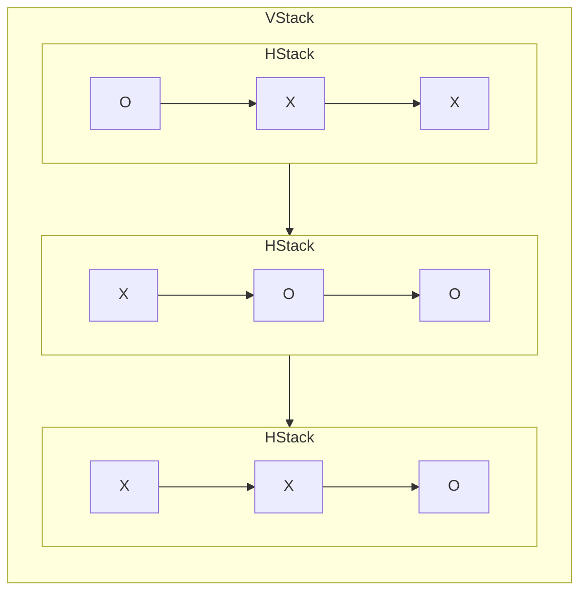
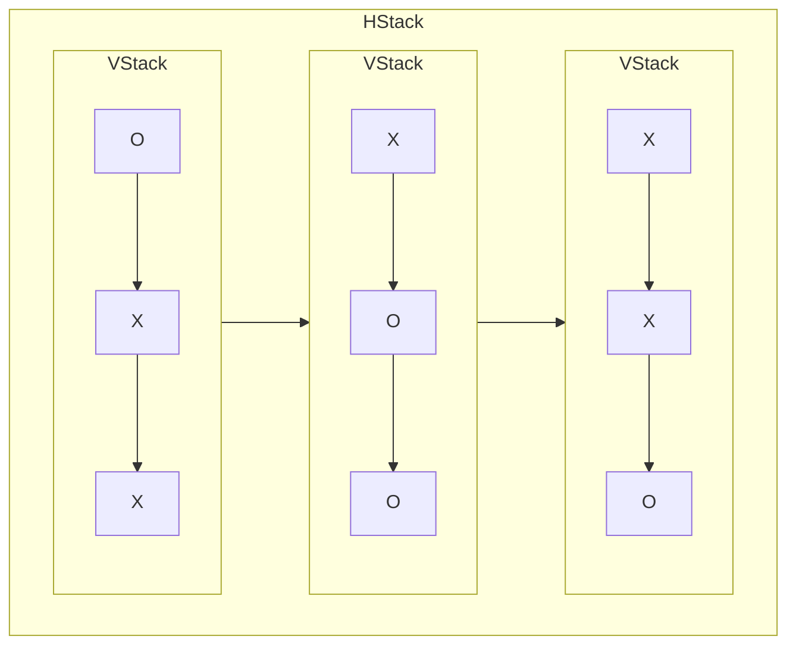

# SwiftUI Views

[](https://livebook.dev/run?url=https%3A%2F%2Fraw.githubusercontent.com%2Fliveview-native%2Flive_view_native%2Fmain%2Fguides%livebooks%swiftui-views.livemd)

## Overview

LiveView Native aims to use minimal SwiftUI code. All patterns for building interactive UIs are the same as LiveView. However, unlike LiveView for the web, LiveView Native uses SwiftUI templates to build the native UI.

This lesson will teach you how to build SwiftUI templates using common SwiftUI views. We'll cover common uses of each view and give you practical examples you can use to build your own native UIs. This lesson is like a recipe book you can refer back to whenever you need an example of how to use a particular SwiftUI view. In addition, once you understand how to convert these views into the LiveView Native DSL, you should have the tools to convert essentially any SwiftUI View into the LiveView Native DSL.

## Render Components

LiveView Native `0.3.0` introduced render components to better encourage isolation of native and web templates and move away from co-location templates within the same LiveView module.

Render components are namespaced under the main LiveView, and are responsible for defining the `render/1` callback function that returns the native template.

For example, and `ExampleLive` LiveView module would have an `ExampleLive.SwiftUI` render component module for the native Template.

This `ExampleLive.SwiftUI` render component may define a `render/1` callback function as seen below.

<!-- livebook:{"attrs":"eyJjb2RlIjoiIyBSZW5kZXIgQ29tcG9uZW50XG5kZWZtb2R1bGUgU2VydmVyV2ViLkV4YW1wbGVMaXZlLlN3aWZ0VUkgZG9cbiAgdXNlIFNlcnZlck5hdGl2ZSwgWzpyZW5kZXJfY29tcG9uZW50LCBmb3JtYXQ6IDpzd2lmdHVpXVxuXG4gIGRlZiByZW5kZXIoYXNzaWducykgZG9cbiAgICB+TFZOXCJcIlwiXG4gICAgPFRleHQ+SGVsbG8sIGZyb20gTGl2ZVZpZXcgTmF0aXZlITwvVGV4dD5cbiAgICBcIlwiXCJcbiAgZW5kXG5lbmRcblxuIyBMaXZlVmlld1xuZGVmbW9kdWxlIFNlcnZlcldlYi5FeGFtcGxlTGl2ZSBkb1xuICB1c2UgU2VydmVyV2ViLCA6bGl2ZV92aWV3XG4gIHVzZSBTZXJ2ZXJOYXRpdmUsIDpsaXZlX3ZpZXdcblxuICBAaW1wbCB0cnVlXG4gIGRlZiByZW5kZXIoYXNzaWducykgZG9cbiAgICB+SFwiXCJcIlxuICAgIDxwPkhlbGxvIGZyb20gTGl2ZVZpZXchPC9wPlxuICAgIFwiXCJcIlxuICBlbmRcbmVuZCIsInBhdGgiOiIvIn0","chunks":[[0,85],[87,426],[515,49],[566,51]],"kind":"Elixir.Server.SmartCells.LiveViewNative","livebook_object":"smart_cell"} -->

```elixir
# Render Component
defmodule ServerWeb.ExampleLive.SwiftUI do
  use ServerNative, [:render_component, format: :swiftui]

  def render(assigns) do
    ~LVN"""
    <Text>Hello, from LiveView Native!</Text>
    """
  end
end

# LiveView
defmodule ServerWeb.ExampleLive do
  use ServerWeb, :live_view
  use ServerNative, :live_view

  @impl true
  def render(assigns) do
    ~H"""
    <p>Hello from LiveView!</p>
    """
  end
end
```

Throughout this and further material we'll re-define render components you can evaluate and see reflected in your Xcode iOS simulator.

<!-- livebook:{"attrs":"eyJjb2RlIjoiZGVmbW9kdWxlIFNlcnZlcldlYi5FeGFtcGxlTGl2ZS5Td2lmdFVJIGRvXG4gIHVzZSBTZXJ2ZXJOYXRpdmUsIFs6cmVuZGVyX2NvbXBvbmVudCwgZm9ybWF0OiA6c3dpZnR1aV1cblxuICBkZWYgcmVuZGVyKGFzc2lnbnMsIF9pbnRlcmZhY2UpIGRvXG4gICAgfkxWTlwiXCJcIlxuICAgIDxUZXh0PkhlbGxvLCBmcm9tIGEgTGl2ZVZpZXcgTmF0aXZlIFJlbmRlciBDb21wb25lbnQhPC9UZXh0PlxuICAgIFwiXCJcIlxuICBlbmRcbmVuZCJ9","chunks":[[0,85],[87,233],[322,47],[371,51]],"kind":"Elixir.Server.SmartCells.RenderComponent","livebook_object":"smart_cell"} -->

```elixir
defmodule ServerWeb.ExampleLive.SwiftUI do
  use ServerNative, [:render_component, format: :swiftui]

  def render(assigns, _interface) do
    ~LVN"""
    <Text>Hello, from a LiveView Native Render Component!</Text>
    """
  end
end
```

### Embedding Templates

Alternatively, you may omit the render callback and instead define a `.neex` (Native + Embedded Elixir) template.

By default, the module above would look for a template in the `swiftui/example_live*` path relative to the module's location. You can see the `LiveViewNative.Component` documentation for further explanation.

For the sake of ease when working in Livebook, we'll prefer defining the `render/1` callback. However, we recommend you generally prefer template files when working locally in Phoenix LiveView Native projects.

## SwiftUI Views

In SwiftUI, a "View" is like a building block for what you see on your app's screen. It can be something simple like text or an image, or something more complex like a layout with multiple elements. Views are the pieces that make up your app's user interface.

Here's an example `Text` view that represents a text element.

```swift
Text("Hamlet")
```

LiveView Native uses the following syntax to represent the view above.

<!-- livebook:{"force_markdown":true} -->

```elixir
<Text>Hamlet</Text>
```

SwiftUI provides a wide range of Views that can be used in native templates. You can find a full reference of these views in the SwiftUI Documentation at https://developer.apple.com/documentation/swiftui/. You can also find a shorthand on how to convert SwiftUI syntax into the LiveView Native DLS in the [LiveView Native Syntax Conversion Cheatsheet](https://hexdocs.pm/live_view_native/cheatsheet.cheatmd).

## Text

We've already seen the [Text](https://developer.apple.com/documentation/swiftui/text) view, but we'll start simple to get the interactive tutorial running.

Evaluate the cell below, then in Xcode, Start the iOS application you created in the [Create a SwiftUI Application](https://hexdocs.pm/live_view_native/create-a-swiftui-application.html) lesson and ensure you see the `"Hello, from LiveView Native!"` text.

<!-- livebook:{"attrs":"e30","chunks":[[0,85],[87,202],[291,47],[340,51]],"kind":"Elixir.Server.SmartCells.RenderComponent","livebook_object":"smart_cell"} -->

```elixir
defmodule ServerWeb.ExampleLive.SwiftUI do
  use ServerNative, [:render_component, format: :swiftui]

  def render(assigns) do
    ~LVN"""
    <Text>Hello, from LiveView Native!</Text>
    """
  end
end
```

## HStack and VStack

SwiftUI includes many [Layout](https://developer.apple.com/documentation/swiftui/layout-fundamentals) container views you can use to arrange your user Interface. Here are a few of the most commonly used:

* [VStack](https://developer.apple.com/documentation/swiftui/vstack): Vertically arranges nested views.
* [HStack](https://developer.apple.com/documentation/swiftui/hstack): Horizontally arranges nested views.

Below, we've created a simple 3X3 game board to demonstrate how to use `VStack` and `HStack` to build a layout of horizontal rows in a single vertical column.o

Here's a diagram to demonstrate how these rows and columns create our desired layout.



Evaluate the example below and view the working 3X3 layout in your Xcode simulator.

<!-- livebook:{"attrs":"eyJjb2RlIjoiZGVmbW9kdWxlIFNlcnZlcldlYi5FeGFtcGxlTGl2ZS5Td2lmdFVJIGRvXG4gIHVzZSBMaXZlVmlld05hdGl2ZS5Db21wb25lbnQsXG4gICAgZm9ybWF0OiA6c3dpZnR1aVxuXG4gIGRlZiByZW5kZXIoYXNzaWducywgX2ludGVyZmFjZSkgZG9cbiAgICB+TFZOXCJcIlwiXG4gICAgPFZTdGFjaz5cbiAgICAgIDxIU3RhY2s+XG4gICAgICAgIDxUZXh0Pk88L1RleHQ+XG4gICAgICAgIDxUZXh0Plg8L1RleHQ+XG4gICAgICAgIDxUZXh0Plg8L1RleHQ+XG4gICAgICA8L0hTdGFjaz5cbiAgICAgIDxIU3RhY2s+XG4gICAgICAgIDxUZXh0Plg8L1RleHQ+XG4gICAgICAgIDxUZXh0Pk88L1RleHQ+XG4gICAgICAgIDxUZXh0Pk88L1RleHQ+XG4gICAgICA8L0hTdGFjaz5cbiAgICAgIDxIU3RhY2s+XG4gICAgICAgIDxUZXh0Plg8L1RleHQ+XG4gICAgICAgIDxUZXh0Plg8L1RleHQ+XG4gICAgICAgIDxUZXh0Pk88L1RleHQ+XG4gICAgICA8L0hTdGFjaz5cbiAgICA8L1ZTdGFjaz5cbiAgICBcIlwiXCJcbiAgZW5kXG5lbmQifQ","chunks":[[0,85],[87,490],[579,47],[628,51]],"kind":"Elixir.Server.SmartCells.RenderComponent","livebook_object":"smart_cell"} -->

```elixir
defmodule ServerWeb.ExampleLive.SwiftUI do
  use LiveViewNative.Component,
    format: :swiftui

  def render(assigns, _interface) do
    ~LVN"""
    <VStack>
      <HStack>
        <Text>O</Text>
        <Text>X</Text>
        <Text>X</Text>
      </HStack>
      <HStack>
        <Text>X</Text>
        <Text>O</Text>
        <Text>O</Text>
      </HStack>
      <HStack>
        <Text>X</Text>
        <Text>X</Text>
        <Text>O</Text>
      </HStack>
    </VStack>
    """
  end
end
```

### Your Turn: 3x3 board using columns

In the cell below, use `VStack` and `HStack` to create a 3X3 board using 3 columns instead of 3 rows as demonstrated above. The arrangement of `X` and `O` does not matter, however the content will not be properly aligned if you do not have exactly one character in each `Text` element.



### Example Solution

```elixir
defmodule ServerWeb.ExampleLive.SwiftUI do
  use ServerNative, [:render_component, format: :swiftui]

  def render(assigns, _interface) do
    ~LVN"""
    <HStack>
      <VStack>
        <Text>O</Text>
        <Text>X</Text>
        <Text>X</Text>
      </VStack>
      <VStack>
        <Text>X</Text>
        <Text>O</Text>
        <Text>O</Text>
      </VStack>
      <VStack>
        <Text>X</Text>
        <Text>X</Text>
        <Text>O</Text>
      </VStack>
    </HStack>
    """
  end
end
```


<!-- livebook:{"break_markdown":true} -->

### Enter Your Solution Below

<!-- livebook:{"attrs":"eyJjb2RlIjoiZGVmbW9kdWxlIFNlcnZlcldlYi5FeGFtcGxlTGl2ZS5Td2lmdFVJIGRvXG4gIHVzZSBMaXZlVmlld05hdGl2ZS5Db21wb25lbnQsXG4gICAgZm9ybWF0OiA6c3dpZnR1aVxuXG4gIGRlZiByZW5kZXIoYXNzaWducywgX2ludGVyZmFjZSkgZG9cbiAgICB+TFZOXCJcIlwiXG4gICAgPCEtLSBFbnRlciBzb2x1dGlvbiBiZWxvdyAtLT5cbiAgICBcIlwiXCJcbiAgZW5kXG5lbmQifQ","chunks":[[0,85],[87,197],[286,47],[335,51]],"kind":"Elixir.Server.SmartCells.RenderComponent","livebook_object":"smart_cell"} -->

```elixir
defmodule ServerWeb.ExampleLive.SwiftUI do
  use LiveViewNative.Component,
    format: :swiftui

  def render(assigns, _interface) do
    ~LVN"""
    <!-- Enter solution below -->
    """
  end
end
```

## Grid

`VStack` and `HStack` do not provide vertical-alignment between horizontal rows. Notice in the following example that the rows/columns of the 3X3 board are not aligned, just centered.

<!-- livebook:{"attrs":"eyJjb2RlIjoiZGVmbW9kdWxlIFNlcnZlcldlYi5FeGFtcGxlTGl2ZS5Td2lmdFVJIGRvXG4gIHVzZSBMaXZlVmlld05hdGl2ZS5Db21wb25lbnQsXG4gICAgZm9ybWF0OiA6c3dpZnR1aVxuXG4gIGRlZiByZW5kZXIoYXNzaWducywgX2ludGVyZmFjZSkgZG9cbiAgICB+TFZOXCJcIlwiXG4gICAgPFZTdGFjaz5cbiAgICAgIDxIU3RhY2s+XG4gICAgICAgIDxUZXh0Plg8L1RleHQ+XG4gICAgICAgIDxUZXh0Plg8L1RleHQ+XG4gICAgICA8L0hTdGFjaz5cbiAgICAgIDxIU3RhY2s+XG4gICAgICAgIDxUZXh0Plg8L1RleHQ+XG4gICAgICAgIDxUZXh0Pk88L1RleHQ+XG4gICAgICAgIDxUZXh0Pk88L1RleHQ+XG4gICAgICA8L0hTdGFjaz5cbiAgICAgIDxIU3RhY2s+XG4gICAgICAgIDxUZXh0Plg8L1RleHQ+XG4gICAgICAgIDxUZXh0Pk88L1RleHQ+XG4gICAgICA8L0hTdGFjaz5cbiAgICA8L1ZTdGFjaz5cbiAgICBcIlwiXCJcbiAgZW5kXG5lbmQifQ","chunks":[[0,85],[87,444],[533,47],[582,51]],"kind":"Elixir.Server.SmartCells.RenderComponent","livebook_object":"smart_cell"} -->

```elixir
defmodule ServerWeb.ExampleLive.SwiftUI do
  use LiveViewNative.Component,
    format: :swiftui

  def render(assigns, _interface) do
    ~LVN"""
    <VStack>
      <HStack>
        <Text>X</Text>
        <Text>X</Text>
      </HStack>
      <HStack>
        <Text>X</Text>
        <Text>O</Text>
        <Text>O</Text>
      </HStack>
      <HStack>
        <Text>X</Text>
        <Text>O</Text>
      </HStack>
    </VStack>
    """
  end
end
```

Fortunately, we have a few common elements for creating a grid-based layout.

* [Grid](https://developer.apple.com/documentation/swiftui/grid): A grid that arranges its child views in rows and columns that you specify.
* [GridRow](https://developer.apple.com/documentation/swiftui/gridrow): A view that arranges its children in a horizontal line.

A grid layout vertically and horizontally aligns elements in the grid based on the number of elements in each row.

Evaluate the example below and notice that rows and columns are aligned.

<!-- livebook:{"attrs":"eyJjb2RlIjoiZGVmbW9kdWxlIFNlcnZlcldlYi5FeGFtcGxlTGl2ZS5Td2lmdFVJIGRvXG4gIHVzZSBMaXZlVmlld05hdGl2ZS5Db21wb25lbnQsXG4gICAgZm9ybWF0OiA6c3dpZnR1aVxuXG4gIGRlZiByZW5kZXIoYXNzaWducywgX2ludGVyZmFjZSkgZG9cbiAgICB+TFZOXCJcIlwiXG4gICAgPEdyaWQ+XG4gICAgICA8R3JpZFJvdz5cbiAgICAgICAgPFRleHQ+WFg8L1RleHQ+XG4gICAgICAgIDxUZXh0Plg8L1RleHQ+XG4gICAgICAgIDxUZXh0Plg8L1RleHQ+XG4gICAgICA8L0dyaWRSb3c+XG4gICAgICA8R3JpZFJvdz5cbiAgICAgICAgPFRleHQ+WDwvVGV4dD5cbiAgICAgICAgPFRleHQ+WDwvVGV4dD5cbiAgICAgIDwvR3JpZFJvdz5cbiAgICAgIDxHcmlkUm93PlxuICAgICAgICA8VGV4dD5YPC9UZXh0PlxuICAgICAgICA8VGV4dD5YPC9UZXh0PlxuICAgICAgICA8VGV4dD5YPC9UZXh0PlxuICAgICAgPC9HcmlkUm93PlxuICAgIDwvR3JpZD5cbiAgICBcIlwiXCJcbiAgZW5kXG5lbmQifQ","chunks":[[0,85],[87,470],[559,47],[608,51]],"kind":"Elixir.Server.SmartCells.RenderComponent","livebook_object":"smart_cell"} -->

```elixir
defmodule ServerWeb.ExampleLive.SwiftUI do
  use LiveViewNative.Component,
    format: :swiftui

  def render(assigns, _interface) do
    ~LVN"""
    <Grid>
      <GridRow>
        <Text>XX</Text>
        <Text>X</Text>
        <Text>X</Text>
      </GridRow>
      <GridRow>
        <Text>X</Text>
        <Text>X</Text>
      </GridRow>
      <GridRow>
        <Text>X</Text>
        <Text>X</Text>
        <Text>X</Text>
      </GridRow>
    </Grid>
    """
  end
end
```

## List

The SwiftUI [List](https://developer.apple.com/documentation/swiftui/list) view provides a system-specific interface, and has better performance for large amounts of scrolling elements.

<!-- livebook:{"attrs":"eyJjb2RlIjoiZGVmbW9kdWxlIFNlcnZlcldlYi5FeGFtcGxlTGl2ZS5Td2lmdFVJIGRvXG4gIHVzZSBMaXZlVmlld05hdGl2ZS5Db21wb25lbnQsXG4gICAgZm9ybWF0OiA6c3dpZnR1aVxuXG4gIGRlZiByZW5kZXIoYXNzaWducywgX2ludGVyZmFjZSkgZG9cbiAgICB+TFZOXCJcIlwiXG4gICAgPExpc3Q+XG4gICAgICA8VGV4dD5JdGVtIDE8L1RleHQ+XG4gICAgICA8VGV4dD5JdGVtIDI8L1RleHQ+XG4gICAgICA8VGV4dD5JdGVtIDM8L1RleHQ+XG4gICAgPC9MaXN0PlxuICAgIFwiXCJcIlxuICBlbmRcbmVuZCJ9","chunks":[[0,85],[87,264],[353,47],[402,51]],"kind":"Elixir.Server.SmartCells.RenderComponent","livebook_object":"smart_cell"} -->

```elixir
defmodule ServerWeb.ExampleLive.SwiftUI do
  use LiveViewNative.Component,
    format: :swiftui

  def render(assigns, _interface) do
    ~LVN"""
    <List>
      <Text>Item 1</Text>
      <Text>Item 2</Text>
      <Text>Item 3</Text>
    </List>
    """
  end
end
```

### Multi-dimensional lists

Alternatively we can separate children within a `List` view in a `Section` view as seen in the example below. Views in the `Section` can have the `template` attribute with a `"header"` or `"footer"` value which controls how the content is displayed above or below the section.

<!-- livebook:{"attrs":"eyJjb2RlIjoiZGVmbW9kdWxlIFNlcnZlcldlYi5FeGFtcGxlTGl2ZS5Td2lmdFVJIGRvXG4gIHVzZSBMaXZlVmlld05hdGl2ZS5Db21wb25lbnQsXG4gICAgZm9ybWF0OiA6c3dpZnR1aVxuXG4gIGRlZiByZW5kZXIoYXNzaWducywgX2ludGVyZmFjZSkgZG9cbiAgICB+TFZOXCJcIlwiXG4gICAgPExpc3Q+XG4gICAgICA8U2VjdGlvbj5cbiAgICAgICAgPFRleHQgdGVtcGxhdGU9XCJoZWFkZXJcIj5IZWFkZXI8L1RleHQ+XG4gICAgICAgIENvbnRlbnRcbiAgICAgICAgPFRleHQgdGVtcGxhdGU9XCJmb290ZXJcIj5Gb290ZXI8L1RleHQ+XG4gICAgICA8L1NlY3Rpb24+XG4gICAgPC9MaXN0PlxuICAgIFwiXCJcIlxuICBlbmRcbmVuZCJ9","chunks":[[0,85],[87,327],[416,47],[465,51]],"kind":"Elixir.Server.SmartCells.RenderComponent","livebook_object":"smart_cell"} -->

```elixir
defmodule ServerWeb.ExampleLive.SwiftUI do
  use LiveViewNative.Component,
    format: :swiftui

  def render(assigns, _interface) do
    ~LVN"""
    <List>
      <Section>
        <Text template="header">Header</Text>
        Content
        <Text template="footer">Footer</Text>
      </Section>
    </List>
    """
  end
end
```

## ScrollView

The SwiftUI [ScrollView](https://developer.apple.com/documentation/swiftui/scrollview) displays content within a scrollable region. ScrollView is often used in combination with [LazyHStack](https://developer.apple.com/documentation/swiftui/lazyvstack), [LazyVStack](https://developer.apple.com/documentation/swiftui/lazyhstack), [LazyHGrid](https://developer.apple.com/documentation/swiftui/lazyhgrid), and [LazyVGrid](https://developer.apple.com/documentation/swiftui/lazyhgrid) to create scrollable layouts optimized for displaying large amounts of data.

While `ScrollView` also works with typical `VStack` and `HStack` views, they are not optimal choices for large amounts of data.

<!-- livebook:{"break_markdown":true} -->

### ScrollView with VStack

Here's an example using a `ScrollView` and a `HStack` to create scrollable text arranged horizontally.

<!-- livebook:{"attrs":"eyJjb2RlIjoiZGVmbW9kdWxlIFNlcnZlcldlYi5FeGFtcGxlTGl2ZS5Td2lmdFVJIGRvXG4gIHVzZSBMaXZlVmlld05hdGl2ZS5Db21wb25lbnQsXG4gICAgZm9ybWF0OiA6c3dpZnR1aVxuXG4gIGRlZiByZW5kZXIoYXNzaWducywgX2ludGVyZmFjZSkgZG9cbiAgICB+TFZOXCJcIlwiXG4gICAgPFNjcm9sbFZpZXc+XG4gICAgICA8VlN0YWNrPlxuICAgICAgICA8VGV4dCA6Zm9yPXtuIDwtIDEuLjEwMH0+SXRlbSA8JT0gbiAlPjwvVGV4dD5cbiAgICAgIDwvVlN0YWNrPlxuICAgIDwvU2Nyb2xsVmlldz5cbiAgICBcIlwiXCJcbiAgZW5kXG5lbmQifQ","chunks":[[0,85],[87,283],[372,47],[421,51]],"kind":"Elixir.Server.SmartCells.RenderComponent","livebook_object":"smart_cell"} -->

```elixir
defmodule ServerWeb.ExampleLive.SwiftUI do
  use LiveViewNative.Component,
    format: :swiftui

  def render(assigns, _interface) do
    ~LVN"""
    <ScrollView>
      <VStack>
        <Text :for={n <- 1..100}>Item <%= n %></Text>
      </VStack>
    </ScrollView>
    """
  end
end
```

### ScrollView with HStack

By default, the [axes](https://developer.apple.com/documentation/swiftui/scrollview/axes) of a `ScrollView` is vertical. To make a horizontal `ScrollView`, set the `axes` attribute to `"horizontal"` as seen in the example below.

<!-- livebook:{"attrs":"eyJjb2RlIjoiZGVmbW9kdWxlIFNlcnZlcldlYi5FeGFtcGxlTGl2ZS5Td2lmdFVJIGRvXG4gIHVzZSBMaXZlVmlld05hdGl2ZS5Db21wb25lbnQsXG4gICAgZm9ybWF0OiA6c3dpZnR1aVxuXG4gIGRlZiByZW5kZXIoYXNzaWducywgX2ludGVyZmFjZSkgZG9cbiAgICB+TFZOXCJcIlwiXG4gICAgPFNjcm9sbFZpZXcgYXhlcz1cImhvcml6b250YWxcIj5cbiAgICAgIDxIU3RhY2s+XG4gICAgICAgIDxUZXh0IDpmb3I9e24gPC0gMS4uMTAwfT5JdGVtIDwlPSBuICU+PC9UZXh0PlxuICAgICAgPC9IU3RhY2s+XG4gICAgPC9TY3JvbGxWaWV3PlxuICAgIFwiXCJcIlxuICBlbmRcbmVuZCJ9","chunks":[[0,85],[87,301],[390,47],[439,51]],"kind":"Elixir.Server.SmartCells.RenderComponent","livebook_object":"smart_cell"} -->

```elixir
defmodule ServerWeb.ExampleLive.SwiftUI do
  use LiveViewNative.Component,
    format: :swiftui

  def render(assigns, _interface) do
    ~LVN"""
    <ScrollView axes="horizontal">
      <HStack>
        <Text :for={n <- 1..100}>Item <%= n %></Text>
      </HStack>
    </ScrollView>
    """
  end
end
```

### Optimized ScrollView with LazyHStack and LazyVStack

`VStack` and `HStack` are inefficient for large amounts of data because they render every child view. To demonstrate this, evaluate the example below. You should experience lag when you attempt to scroll.

<!-- livebook:{"attrs":"eyJjb2RlIjoiZGVmbW9kdWxlIFNlcnZlcldlYi5FeGFtcGxlTGl2ZS5Td2lmdFVJIGRvXG4gIHVzZSBMaXZlVmlld05hdGl2ZS5Db21wb25lbnQsXG4gICAgZm9ybWF0OiA6c3dpZnR1aVxuXG4gIGRlZiByZW5kZXIoYXNzaWducywgX2ludGVyZmFjZSkgZG9cbiAgICB+TFZOXCJcIlwiXG4gICAgPFNjcm9sbFZpZXc+XG4gICAgICA8VlN0YWNrPlxuICAgICAgICA8VGV4dCA6Zm9yPXtuIDwtIDEuLjEwMDAwfT5JdGVtIDwlPSBuICU+PC9UZXh0PlxuICAgICAgPC9WU3RhY2s+XG4gICAgPC9TY3JvbGxWaWV3PlxuICAgIFwiXCJcIlxuICBlbmRcbmVuZCJ9","chunks":[[0,85],[87,285],[374,47],[423,51]],"kind":"Elixir.Server.SmartCells.RenderComponent","livebook_object":"smart_cell"} -->

```elixir
defmodule ServerWeb.ExampleLive.SwiftUI do
  use LiveViewNative.Component,
    format: :swiftui

  def render(assigns, _interface) do
    ~LVN"""
    <ScrollView>
      <VStack>
        <Text :for={n <- 1..10000}>Item <%= n %></Text>
      </VStack>
    </ScrollView>
    """
  end
end
```

To resolve the performance problem for large amounts of data, you can use the Lazy views. Lazy views only create items as needed. Items won't be rendered until they are present on the screen.

The next example demonstrates how using `LazyVStack` instead of `VStack` resolves the performance issue.

<!-- livebook:{"attrs":"eyJjb2RlIjoiZGVmbW9kdWxlIFNlcnZlcldlYi5FeGFtcGxlTGl2ZS5Td2lmdFVJIGRvXG4gIHVzZSBMaXZlVmlld05hdGl2ZS5Db21wb25lbnQsXG4gICAgZm9ybWF0OiA6c3dpZnR1aVxuXG4gIGRlZiByZW5kZXIoYXNzaWducywgX2ludGVyZmFjZSkgZG9cbiAgICB+TFZOXCJcIlwiXG4gICAgPFNjcm9sbFZpZXc+XG4gICAgICA8TGF6eVZTdGFjaz5cbiAgICAgICAgPFRleHQgOmZvcj17biA8LSAxLi4xMDAwMH0+SXRlbSA8JT0gbiAlPjwvVGV4dD5cbiAgICAgIDwvTGF6eVZTdGFjaz5cbiAgICA8L1Njcm9sbFZpZXc+XG4gICAgXCJcIlwiXG4gIGVuZFxuZW5kIn0","chunks":[[0,85],[87,293],[382,47],[431,51]],"kind":"Elixir.Server.SmartCells.RenderComponent","livebook_object":"smart_cell"} -->

```elixir
defmodule ServerWeb.ExampleLive.SwiftUI do
  use LiveViewNative.Component,
    format: :swiftui

  def render(assigns, _interface) do
    ~LVN"""
    <ScrollView>
      <LazyVStack>
        <Text :for={n <- 1..10000}>Item <%= n %></Text>
      </LazyVStack>
    </ScrollView>
    """
  end
end
```

## Spacers

[Spacers](https://developer.apple.com/documentation/swiftui/spacer) take up all remaining space in a container.


> Image originally from https://developer.apple.com/documentation/swiftui/spacer

Evaluate the following example and notice the `Text` element is pushed to the right by the `Spacer`.

<!-- livebook:{"attrs":"eyJjb2RlIjoiZGVmbW9kdWxlIFNlcnZlcldlYi5FeGFtcGxlTGl2ZS5Td2lmdFVJIGRvXG4gIHVzZSBMaXZlVmlld05hdGl2ZS5Db21wb25lbnQsXG4gICAgZm9ybWF0OiA6c3dpZnR1aVxuXG4gIGRlZiByZW5kZXIoYXNzaWducywgX2ludGVyZmFjZSkgZG9cbiAgICB+TFZOXCJcIlwiXG4gICAgPEhTdGFjaz5cbiAgICAgIDxTcGFjZXIvPlxuICAgICAgPFRleHQ+VGhpcyB0ZXh0IGlzIHB1c2hlZCB0byB0aGUgcmlnaHQ8L1RleHQ+XG4gICAgPC9IU3RhY2s+XG4gICAgXCJcIlwiXG4gIGVuZFxuZW5kIn0","chunks":[[0,85],[87,258],[347,47],[396,51]],"kind":"Elixir.Server.SmartCells.RenderComponent","livebook_object":"smart_cell"} -->

```elixir
defmodule ServerWeb.ExampleLive.SwiftUI do
  use LiveViewNative.Component,
    format: :swiftui

  def render(assigns, _interface) do
    ~LVN"""
    <HStack>
      <Spacer/>
      <Text>This text is pushed to the right</Text>
    </HStack>
    """
  end
end
```

### Your Turn: Bottom Text Spacer

In the cell below, use `VStack` and `Spacer` to place text in the bottom of the native view.

### Example Solution

```elixir
defmodule ServerWeb.ExampleLive.SwiftUI do
  use ServerNative, [:render_component, format: :swiftui]

  def render(assigns, _interface) do
    ~LVN"""
    <VStack>
      <Spacer/>
      <Text>Hello</Text>
    </VStack>
    """
  end
end
```


<!-- livebook:{"break_markdown":true} -->

### Enter Your Solution Below

<!-- livebook:{"attrs":"eyJjb2RlIjoiZGVmbW9kdWxlIFNlcnZlcldlYi5FeGFtcGxlTGl2ZS5Td2lmdFVJIGRvXG4gIHVzZSBMaXZlVmlld05hdGl2ZS5Db21wb25lbnQsXG4gICAgZm9ybWF0OiA6c3dpZnR1aVxuXG4gIGRlZiByZW5kZXIoYXNzaWducywgX2ludGVyZmFjZSkgZG9cbiAgICB+TFZOXCJcIlwiXG4gICAgPCEtLSBFbnRlciBzb2x1dGlvbiBiZWxvdyAtLT5cbiAgICBcIlwiXCJcbiAgZW5kXG5lbmQifQ","chunks":[[0,85],[87,197],[286,47],[335,51]],"kind":"Elixir.Server.SmartCells.RenderComponent","livebook_object":"smart_cell"} -->

```elixir
defmodule ServerWeb.ExampleLive.SwiftUI do
  use LiveViewNative.Component,
    format: :swiftui

  def render(assigns, _interface) do
    ~LVN"""
    <!-- Enter solution below -->
    """
  end
end
```

## AsyncImage

`AsyncImage` is best for network images, or images served by the Phoenix server.

Here's an example of `AsyncImage` with a lorem picsum image from https://picsum.photos/400/600.

<!-- livebook:{"attrs":"eyJjb2RlIjoiZGVmbW9kdWxlIFNlcnZlcldlYi5FeGFtcGxlTGl2ZS5Td2lmdFVJIGRvXG4gIHVzZSBMaXZlVmlld05hdGl2ZS5Db21wb25lbnQsXG4gICAgZm9ybWF0OiA6c3dpZnR1aVxuXG4gIGRlZiByZW5kZXIoYXNzaWducywgX2ludGVyZmFjZSkgZG9cbiAgICB+TFZOXCJcIlwiXG4gICAgPEFzeW5jSW1hZ2UgdXJsPVwiaHR0cHM6Ly9waWNzdW0ucGhvdG9zLzQwMC80MDBcIi8+XG4gICAgXCJcIlwiXG4gIGVuZFxuZW5kIn0","chunks":[[0,85],[87,217],[306,47],[355,51]],"kind":"Elixir.Server.SmartCells.RenderComponent","livebook_object":"smart_cell"} -->

```elixir
defmodule ServerWeb.ExampleLive.SwiftUI do
  use LiveViewNative.Component,
    format: :swiftui

  def render(assigns, _interface) do
    ~LVN"""
    <AsyncImage url="https://picsum.photos/400/400"/>
    """
  end
end
```

### Loading Spinner

`AsyncImage` displays a loading spinner while loading the image. Here's an example of using `AsyncImage` without a URL so that it loads forever.

<!-- livebook:{"attrs":"eyJjb2RlIjoiZGVmbW9kdWxlIFNlcnZlcldlYi5FeGFtcGxlTGl2ZS5Td2lmdFVJIGRvXG4gIHVzZSBMaXZlVmlld05hdGl2ZS5Db21wb25lbnQsXG4gICAgZm9ybWF0OiA6c3dpZnR1aVxuXG4gIGRlZiByZW5kZXIoYXNzaWducywgX2ludGVyZmFjZSkgZG9cbiAgICB+TFZOXCJcIlwiXG4gICAgPEFzeW5jSW1hZ2UgdXJsPVwiXCI+PC9Bc3luY0ltYWdlPlxuICAgIFwiXCJcIlxuICBlbmRcbmVuZCJ9","chunks":[[0,85],[87,200],[289,47],[338,51]],"kind":"Elixir.Server.SmartCells.RenderComponent","livebook_object":"smart_cell"} -->

```elixir
defmodule ServerWeb.ExampleLive.SwiftUI do
  use LiveViewNative.Component,
    format: :swiftui

  def render(assigns, _interface) do
    ~LVN"""
    <AsyncImage url=""></AsyncImage>
    """
  end
end
```

### Relative Path

For images served by the Phoenix server, LiveView Native evaluates URLs relative to the LiveView's host URL. This way you can use the path to static resources as you normally would in a Phoenix application.

For example, the path `/images/logo.png` evaluates as http://localhost:4000/images/logo.png below. This serves the LiveView Native logo.

Evaluate the example below to see the LiveView Native logo in the iOS simulator.

<!-- livebook:{"attrs":"eyJjb2RlIjoiZGVmbW9kdWxlIFNlcnZlcldlYi5FeGFtcGxlTGl2ZS5Td2lmdFVJIGRvXG4gIHVzZSBMaXZlVmlld05hdGl2ZS5Db21wb25lbnQsXG4gICAgZm9ybWF0OiA6c3dpZnR1aVxuXG4gIGRlZiByZW5kZXIoYXNzaWducywgX2ludGVyZmFjZSkgZG9cbiAgICB+TFZOXCJcIlwiXG4gICAgPEFzeW5jSW1hZ2UgdXJsPVwiL2ltYWdlcy9sb2dvLnBuZ1wiLz5cbiAgICBcIlwiXCJcbiAgZW5kXG5lbmQifQ","chunks":[[0,85],[87,204],[293,47],[342,51]],"kind":"Elixir.Server.SmartCells.RenderComponent","livebook_object":"smart_cell"} -->

```elixir
defmodule ServerWeb.ExampleLive.SwiftUI do
  use LiveViewNative.Component,
    format: :swiftui

  def render(assigns, _interface) do
    ~LVN"""
    <AsyncImage url="/images/logo.png"/>
    """
  end
end
```

## Image

The `Image` element is best for system images such as the built in [SF Symbols](https://developer.apple.com/design/human-interface-guidelines/sf-symbols) or images placed into the SwiftUI [asset catalogue](https://developer.apple.com/documentation/xcode/managing-assets-with-asset-catalogs).

<!-- livebook:{"break_markdown":true} -->

### System Images

You can use the `system-image` attribute to provide the name of system images to the `Image` element.

For the full list of SF Symbols you can download Apple's [Symbols 5](https://developer.apple.com/sf-symbols/) application.

Evaluate the cell below to see an example using the `square.and.arrow.up` symbol.

<!-- livebook:{"attrs":"eyJjb2RlIjoiZGVmbW9kdWxlIFNlcnZlcldlYi5FeGFtcGxlTGl2ZS5Td2lmdFVJIGRvXG4gIHVzZSBMaXZlVmlld05hdGl2ZS5Db21wb25lbnQsXG4gICAgZm9ybWF0OiA6c3dpZnR1aVxuXG4gIGRlZiByZW5kZXIoYXNzaWducywgX2ludGVyZmFjZSkgZG9cbiAgICB+TFZOXCJcIlwiXG4gICAgPEltYWdlIHN5c3RlbS1uYW1lPVwic3F1YXJlLmFuZC5hcnJvdy51cFwiIC8+XG4gICAgXCJcIlwiXG4gIGVuZFxuZW5kIn0","chunks":[[0,85],[87,211],[300,47],[349,51]],"kind":"Elixir.Server.SmartCells.RenderComponent","livebook_object":"smart_cell"} -->

```elixir
defmodule ServerWeb.ExampleLive.SwiftUI do
  use LiveViewNative.Component,
    format: :swiftui

  def render(assigns, _interface) do
    ~LVN"""
    <Image system-name="square.and.arrow.up" />
    """
  end
end
```

### Your Turn: Asset Catalogue

You can place assets in your SwiftUI application's asset catalogue. Using the asset catalogue for SwiftUI assets provide many benefits such as device-specific image variants, dark mode images, high contrast image mode, and improved performance.

Follow this guide: https://developer.apple.com/documentation/xcode/managing-assets-with-asset-catalogs#Add-a-new-asset to create a new asset called Image.

Then evaluate the following example and you should see this image in your simulator. For a convenient image, you can right-click and save the following LiveView Native logo.


You will need to **rebuild the native application** to pick up the changes to the assets catalogue.

<!-- livebook:{"break_markdown":true} -->

### Enter Your Solution Below

You should not need to make changes to this cell. Set up an image in your asset catalogue named "Image", rebuild your native application, then evaluate this cell. You should see the image in your iOS simulator.

<!-- livebook:{"attrs":"eyJjb2RlIjoiZGVmbW9kdWxlIFNlcnZlcldlYi5FeGFtcGxlTGl2ZS5Td2lmdFVJIGRvXG4gIHVzZSBMaXZlVmlld05hdGl2ZS5Db21wb25lbnQsXG4gICAgZm9ybWF0OiA6c3dpZnR1aVxuXG4gIGRlZiByZW5kZXIoYXNzaWducywgX2ludGVyZmFjZSkgZG9cbiAgICB+TFZOXCJcIlwiXG4gICAgPEltYWdlIG5hbWU9XCJJbWFnZVwiLz5cbiAgICBcIlwiXCJcbiAgZW5kXG5lbmQifQ","chunks":[[0,85],[87,189],[278,47],[327,51]],"kind":"Elixir.Server.SmartCells.RenderComponent","livebook_object":"smart_cell"} -->

```elixir
defmodule ServerWeb.ExampleLive.SwiftUI do
  use LiveViewNative.Component,
    format: :swiftui

  def render(assigns, _interface) do
    ~LVN"""
    <Image name="Image"/>
    """
  end
end
```

## Button

A Button is a clickable SwiftUI View.

The label of a button can be any view, such as a [Text](https://developer.apple.com/documentation/swiftui/text) view for text-only buttons or a [Label](https://developer.apple.com/documentation/swiftui/label) view for buttons with icons.

Evaluate the example below to see the SwiftUI [Button](https://developer.apple.com/documentation/swiftui/button) element.

<!-- livebook:{"attrs":"eyJjb2RlIjoiZGVmbW9kdWxlIFNlcnZlcldlYi5FeGFtcGxlTGl2ZS5Td2lmdFVJIGRvXG4gIHVzZSBMaXZlVmlld05hdGl2ZS5Db21wb25lbnQsXG4gICAgZm9ybWF0OiA6c3dpZnR1aVxuXG4gIGRlZiByZW5kZXIoYXNzaWducywgX2ludGVyZmFjZSkgZG9cbiAgICB+TFZOXCJcIlwiXG4gICAgPEJ1dHRvbj48VGV4dD5UZXh0IEJ1dHRvbjwvVGV4dD48L0J1dHRvbj5cbiAgICA8QnV0dG9uPjxMYWJlbCBzeXN0ZW0taW1hZ2U9XCJib2x0LmZpbGxcIj5JY29uIEJ1dHRvbjwvTGFiZWw+PC9CdXR0b24+XG4gICAgXCJcIlwiXG4gIGVuZFxuZW5kIn0","chunks":[[0,85],[87,282],[371,47],[420,51]],"kind":"Elixir.Server.SmartCells.RenderComponent","livebook_object":"smart_cell"} -->

```elixir
defmodule ServerWeb.ExampleLive.SwiftUI do
  use LiveViewNative.Component,
    format: :swiftui

  def render(assigns, _interface) do
    ~LVN"""
    <Button><Text>Text Button</Text></Button>
    <Button><Label system-image="bolt.fill">Icon Button</Label></Button>
    """
  end
end
```

## Further Resources

See the [SwiftUI Documentation](https://developer.apple.com/documentation/swiftui) for a complete list of SwiftUI elements and the [LiveView Native SwiftUI Documentation](https://liveview-native.github.io/liveview-client-swiftui/documentation/liveviewnative/) for LiveView Native examples of the SwiftUI elements.
