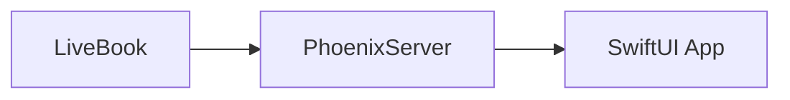
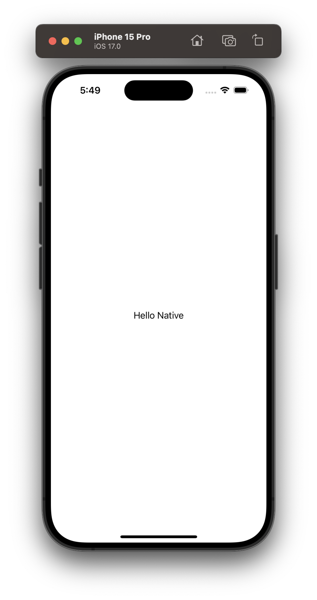
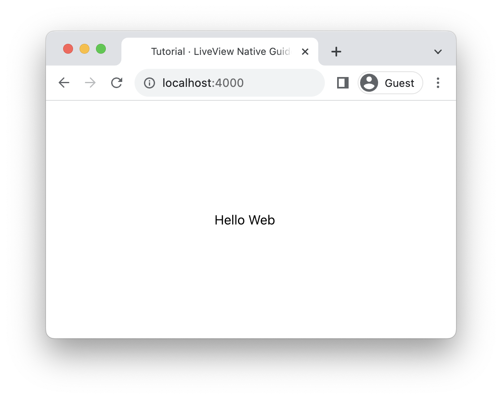

# How These Guides Work

Below, we'll go into technical details on how we provide these interactive notebooks for those who are curious, or for those who want to create similar notebooks of their own. This is not necessary to get started. Skip ahead to the [Getting Started](getting-started.livemd) guide to begin your LiveView Native learning journey!

Our guides use a companion project we've built called [KinoLiveViewNative](https://github.com/liveview-native/kino_live_view_native). This project allows you to run a Phoenix Server within Livebook notebooks and connect an IOS application to the Phoenix server, so you can run examples on the web or in an IOS simulator or physical device using [Xcode](https://developer.apple.com/xcode/).



Here's an example HelloWorld LiveView in a `KinoLiveViewNative` smart cell you could find in one of our notebooks.


<!-- tabs-open -->

### IOS

<div height="800" width="100%" style="display: flex; height: 800px; justify-content: center; align-items: center;">
    
</div>
### Web

<div height="800" width="100%" style="display: flex; height: 800px; justify-content: center; align-items: center;">
    
</div>


<!-- tabs-close -->

[KinoLiveViewNative](https://github.com/liveview-native/kino_live_view_native) implements live reloading with [Phoenix.LiveReloader](https://hexdocs.pm/phoenix_live_reload/Phoenix.LiveReloader.html) so any examples run in Livebook will automatically reload the Phoenix server and appear on the web or native application.

Upon evaluating a smart cell, the Phoenix application's router file automatically updates to include the new LiveView and associated route as if you had defined a route in the `router.ex` file like so:

```elixir
# router.ex
scope "/" do
    pipe_through :browser

    live "/", MyApp.HelloWorldLive, :index
end
```

While just a brief overview, this is ultimately how we're able to provide a seamless experience running LiveView Native from Livebook.